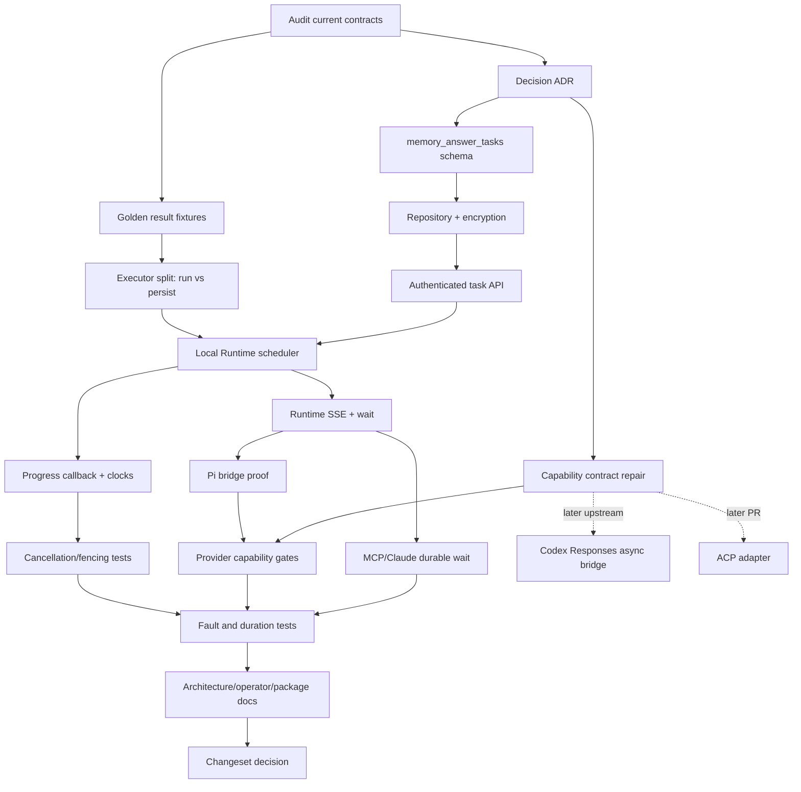

# Durable Memory Answer Implementation Plan

- Status: revised after current-head architecture and SDK audit; implementation not started
- Baseline: `origin/main` at `375455c7` (PR #392)
- Branch: `feat/async-memory-answer-tasks`
- Revision date: 2026-09-10

## Mandatory Implementation Rules

These rules are gates, not preferences:

1. Before implementing a task, compare it with `CONTEXT.md`, accepted ADRs,
   current source, pinned dependency behavior, and current upstream protocols.
   Surface a conflict before changing code. Do not silently route around it.
2. Prefer deleting, generalizing, or reusing an existing path over adding a
   parallel path. Add a layer only when it owns state or behavior that no
   existing layer can own correctly.
3. Koed has no customers requiring migration compatibility. Do not preserve
   obsolete endpoints, environment names, schemas, or duplicate execution
   paths merely for backwards compatibility.
4. Compatibility required by a currently supported AI Client is not legacy
   compatibility. Codex and Claude Code still need a blocking tool result
   unless and until their hosts implement a verified deferred-result contract.
5. Do not claim a capability from a schema, proposal, or provider announcement
   alone. Enable it only after the pinned SDK and supported client version pass
   a protocol trace and end-to-end test.
6. The backend Worker must never synthesize a Memory Answer. Synthesis remains
   owned by the `koed-server`-supervised Local AI Runtime and selected AI Client.
7. Do not expose model-facing status, wait, queue, or cancellation tools. A
   model calls `memory_answer` once.

## Baseline Audit And Corrections

The previous plan was sub-optimal in several material ways. This revision
supersedes it.

### MCP Tasks is not currently a Koed implementation seam

The MCP Tasks extension publishes a draft `2026-07-28` schema, but Koed's pinned
`@modelcontextprotocol/server@2.0.0` deliberately does not implement the
extension runtime. Its core typed runtime excludes task methods and task
results. The extension itself describes `tasks/get` polling as the normal
retrieval mechanism, with optional notifications through subscriptions.

Koed will not hand-roll a second MCP protocol dispatcher around the SDK. Native
MCP Tasks becomes eligible only when all of these are true:

- a maintained TypeScript extension/runtime integrates with the pinned MCP v2
  server without bypassing its codecs or request envelope validation;
- a supported host version opts into `io.modelcontextprotocol/tasks`;
- authorization, cancellation, reconnect, and terminal-result traces pass;
- the host, rather than the model, owns any required polling;
- the implementation is simpler than Koed's direct harness bridge.

Until then, MCP remains a thin blocking adapter over durable execution. This is
not a second execution path: it waits for the same task used by every adapter.

### Accepted ADR conflicts

- ADR 0025 says stdio/request closure cancels Memory Answer execution. Durable
  accepted work must instead survive transport loss. A new ADR will narrow
  cancellation to an explicit authorized cancellation or runtime policy event.
- ADR 0026 says Memory Questions are completed user-facing records, not pending
  jobs, leases, or worker claims. The implementation will preserve that rule.
- ADR 0032 defines `supported`, `requires_bridge`, and `unsupported`, but the
  shared capability descriptor currently models only `supported` and
  `unsupported`. The implementation must repair the contract before publishing
  deferred-delivery capability.
- ADR 0001 and ADR 0025 require Local AI Runtime synthesis. BullMQ workers and
  `apps/worker` therefore cannot consume Memory Answer execution jobs.

### Simplifications from the previous plan

- Use a purpose-built `memory_answer_tasks` table, not a generic
  `async_tool_tasks` framework.
- Do not create pending Memory Questions. Create the final Memory Question only
  when synthesis reaches a terminal result, preserving ADR 0026.
- Do not add a durable notification outbox initially. One Local AI Runtime owns
  local synthesis per `KOED_HOME`; an in-process event hub is delivery only,
  while PostgreSQL state supports reconnect reconciliation.
- Do not use BullMQ or `local_work_queue`. Those queues are consumed by the
  backend Worker and would either move synthesis across the ownership boundary
  or require another queue consumer framework.
- Do not add both synchronous and asynchronous executors. All Memory Answers
  are accepted and run through one durable scheduler. Blocking hosts merely
  wait for that task.
- Do not retain `MEMORY_ANSWER_TIMEOUT_MS` as a deprecated alias. Rename the
  setting directly because there is no customer migration requirement.
- Do not add a queue dashboard or a cancelled Memory Question state. Task
  cancellation is execution state; only completed answer/error records become
  Memory Questions.
- Do not implement ACP now. Preserve provider-neutral task events and capability
  terms so an ACP adapter can be evaluated in a separate PR.

## Target Behavior

```text
AI Client or harness
  -> memory_answer once
  -> thin adapter asks Local AI Runtime to accept work
  -> Local AI Runtime durably creates memory_answer_tasks row through API
  -> Local AI Runtime scheduler claims task with lease + generation fence
  -> selected Codex / Claude / Pi driver performs local synthesis
  -> final Memory Question and task result are persisted
  -> Local AI Runtime pushes terminal state to attached host waiters
  -> host returns or injects the tool result using its native contract
```

Properties:

- PostgreSQL is authoritative for acceptance, status, lease, fence generation,
  cancellation intent, retries, result, and expiry.
- The Local AI Runtime is the only execution owner.
- Process-local listeners are never authoritative. A reconnect performs one
  authorized state read, then attaches to the current runtime stream.
- Disconnecting a blocking MCP adapter detaches its waiter but does not cancel
  accepted work.
- Explicit host cancellation records intent, interrupts the exact leased
  attempt, and fences late completion.
- No query, evidence, answer, caller path, or provider payload is placed in a
  queue message or ordinary log.

## Durable Model

Add `memory_answer_tasks` with:

| Field                                                 | Purpose                                                                       |
| ----------------------------------------------------- | ----------------------------------------------------------------------------- |
| `id`                                                  | Random UUID task handle; always authorized by owner                           |
| `owner_user_id`, `visibility`                         | Personal authorization boundary                                               |
| `origin`                                              | `mcp` or `pi_extension`; Desktop Ask keeps its existing workflow              |
| `invocation_key`                                      | Optional trusted Codex call/Pi tool invocation idempotency key                |
| `request_snapshot`                                    | Envelope-encrypted validated input and caller execution context               |
| `result_snapshot`                                     | Envelope-encrypted exact terminal tool result                                 |
| `question_id`                                         | Final Memory Question link, nullable until completion                         |
| `status`                                              | `accepted`, `running`, `cancel_requested`, `completed`, `failed`, `cancelled` |
| `attempt_count`, `max_attempts`, `available_at`       | Retry policy                                                                  |
| `lease_owner`, `lease_until`, `fence_generation`      | Exclusive local execution                                                     |
| `started_at`, `last_progress_at`, terminal timestamps | Timeout and diagnostics                                                       |

Important constraints:

- Unique `(owner_user_id, origin, invocation_key)` where the key is non-null.
- No task enumeration endpoint.
- Claim uses `FOR UPDATE SKIP LOCKED` and can recover expired leases.
- Heartbeat and terminal writes require owner, task id, lease owner, unexpired
  lease, and exact fence generation.
- Final Personal Memory Question uses a deterministic task-derived idempotency
  key. The fenced task commit follows it; recovery may repeat synthesis after a
  crash between writes but reuses the same question and cannot accept a stale
  result. This keeps encrypted question persistence in its existing repository.
- Team Workspace Memory Answer stays on the existing blocking path until its
  upstream authority can accept and complete the task atomically. Do not create
  a misleading local Personal task for Team work.
- Terminal task handles expire after 24 hours; Memory Question retention is
  independent.

## API And Runtime Contract

Add authenticated API operations used only by the Local AI Runtime:

- accept one Personal Memory Answer task;
- read one owned task;
- claim the next due task;
- heartbeat/progress the current fenced attempt;
- request cancellation;
- complete, fail, or cancel the current fenced attempt;
- clean expired terminal tasks.

The loopback Local AI Runtime contract adds:

- start task;
- get one task;
- cancel one task;
- subscribe to one task as SSE;
- wait for terminal state for blocking adapters.

SSE behavior:

- authenticate every connection with the owner-only runtime bearer;
- emit the current state immediately;
- emit monotonically increasing versions only;
- bound subscribers and frame size;
- use keepalive comments, not synthetic task events;
- on disconnect, the client rereads once and resubscribes with bounded backoff;
- never expose this as a model tool.

No distributed fanout is needed while ADR 0025 guarantees one Local AI Runtime
per `KOED_HOME`. If that invariant changes, revisit an outbox rather than adding
one preemptively.

## Provider Integration

### Codex

Current Koed behavior remains MCP-host waiting over the durable task. True model
continuation requires an upstream Codex change that:

- marks eligible Responses function tools `async: true` only for compatible
  models;
- retains the original Responses `call_id` and pending task mapping;
- consumes a pushed terminal task and submits `function_call_output` against
  that original `call_id`;
- recovers mappings after host restart and prevents duplicate delivery.

Koed must publish this as `requires_bridge` until a released Codex version and
model pass the test matrix. The upstream Codex change is not implemented in
this repository and must not be simulated by returning a receipt as a final
tool result.

### Claude Code and Agent SDK

Claude currently requires the matching tool result before model continuation.
Use the durable task and host wait. This eliminates model polling and survives
backend work longer than the old timeout, but it does not claim model
continuation. Publish continuation as `unsupported` until a native contract is
proven.

### Pi

Pi's Koed-owned extension can potentially detach and later use `sendMessage`
with `triggerTurn`, but provenance and ordering must be proven first. The bridge
is enabled only if tests establish:

- the queued receipt is not interpreted as the final answer;
- terminal output is injected exactly once and visibly attributed to Koed;
- steering and other tool calls cannot reorder the result incorrectly;
- session restart recovers the pending mapping without duplicate synthesis;
- cancellation targets the current task.

Until that proof passes, Pi uses the same durable host wait as MCP. Capability
is `requires_bridge`, not `supported`.

### ACP

No ACP implementation in this change. Later adapters consume the same start,
cancel, state, and terminal-event semantics. ACP display status alone must not
be confused with model continuation.

## Timeout And Cancellation

Replace one fixed wall-clock timeout with three clocks:

- lease: 60 seconds, heartbeat every 15 seconds;
- no-progress watchdog: default 5 minutes, reset only by classified provider
  progress events;
- hard execution ceiling: default 30 minutes.

Remove `MEMORY_ANSWER_TIMEOUT_MS`. Add:

- `MEMORY_ANSWER_NO_PROGRESS_TIMEOUT_MS`;
- `MEMORY_ANSWER_HARD_TIMEOUT_MS`;
- internal bounded lease/heartbeat settings only where tests need overrides.

Provider runners must report meaningful progress through one shared callback.
Timer ticks and heartbeat writes are not progress. Cancellation and watchdog
expiry use the provider's native interrupt/process-tree termination and then
commit through the current fence. A late provider result cannot win.

## UI Scope

There is no queue UI and no new Memory Question state. UI work is limited to
renaming the existing timeout setting to explain no-progress behavior and, if
the hard ceiling is exposed, rendering it as a separate advanced setting.

## Dependency Graph



Tasks on separate branches of the graph may proceed in parallel after their
dependencies are satisfied.

## Workable Checklist

### Decisions and contracts

- [x] **A1** Audit current MCP SDK, source, `CONTEXT.md`, and ADRs. Depends on: none.
- [x] **A2** Identify conflicts and simplify the prior plan. Depends on: A1.
- [x] **A3** Add decision ADR amending ADR 0025 while preserving ADRs 0001 and 0026. Depends on: A2.
- [x] **A4** Add golden fixtures for all synchronous `memory_answer` detail modes. Depends on: A1.
- [x] **A5** Repair capability support to include `requires_bridge`; add deferred execution, host push, and model continuation dimensions. Depends on: A3.

### Durable core

- [x] **B1** Add `memory_answer_tasks` schema and migration with encrypted payload markers and constraints. Depends on: A3.
- [x] **B2** Implement authorized accept/read/claim/heartbeat/cancel/terminal/cleanup repository methods. Depends on: B1.
- [x] **B3** Make final Personal Memory Question creation idempotent by task and fence the following terminal task commit. Depends on: B2, A4.
- [x] **B4** Add PostgreSQL-backed repository tests for idempotency, owner isolation, lease expiry, fencing, cancellation races, and encrypted plaintext absence. Depends on: B2, B3.
- [x] **B5** Add strict authenticated task API schemas/routes and rate limits. Depends on: B2.

### Local AI Runtime

- [x] **C1** Split Memory Answer execution from final persistence without changing result shape. Depends on: A4.
- [x] **C2** Implement the bounded scheduler, immediate nudge, startup recovery, and graceful lease release. Depends on: B5, C1.
- [x] **C3** Make every Personal `memory_answer` use the scheduler; keep Team execution explicit until upstream task authority exists. Depends on: C2.
- [x] **C4** Add authenticated start/get/cancel/SSE/wait loopback routes. Depends on: C2.
- [x] **C5** Add client reconnect reconciliation with bounded backoff and exact-once terminal delivery. Depends on: C4.
- [x] **C6** Remove the in-memory admission queue as correctness state for Personal Memory Answer; retain it only for currently non-durable Team/Desktop paths. Depends on: C2.

### Providers

- [x] **D1** Route MCP and Claude through durable start plus host wait, with no model polling and unchanged result. Depends on: C5.
- [x] **D2** Build a Pi extension fixture proving or rejecting detached completion injection. The current contract proves blocking terminal delivery and does not prove safe detached injection. Depends on: C4.
- [x] **D3** Retain Pi durable host wait because D2 did not prove detached ordering and recovery. Depends on: D2.
- [x] **D4** Publish and test fail-closed provider capability states from supported driver probes. Depends on: A5, D1, D3.
- [x] **D5** Record the Codex Responses async bridge as an upstream dependency with exact required contract and acceptance trace. Depends on: A5.
- [x] **D6** Preserve an ACP adapter seam without adding ACP runtime code. Depends on: A5.

### Timeouts, cancellation, and operations

- [x] **E1** Add a shared provider progress callback and classify real progress events. Depends on: C1.
- [x] **E2** Implement lease heartbeat, no-progress watchdog, hard ceiling, and generation-fenced terminal writes. Depends on: C2, E1.
- [x] **E3** Propagate explicit cancellation through the shared signal to the exact fenced Codex, Claude, or Pi attempt. Depends on: E2.
- [x] **E4** Replace `MEMORY_ANSWER_TIMEOUT_MS` directly; update setting schemas. No timeout control is currently rendered, so no UI component change is required. Depends on: E2.
- [x] **E5** Add redacted lifecycle logs and active-task status diagnostics without task payloads. Depends on: C2.
- [x] **E6** Add terminal task expiry cleanup. Depends on: B2, C2.

### Verification and release

- [ ] **F1** Test adapter/runtime/API restarts at accept, claim, progress, question commit, and terminal delivery boundaries. Depends on: C5, E2.
- [ ] **F2** Test 30-600 second tasks, saturation, retries, cancellation races, and duplicate invocation keys. Depends on: F1.
- [x] **F3** Run Personal authorization and encrypted-storage fixtures against PostgreSQL. Depends on: B4, F1.
- [ ] **F4** Run Codex, Claude, and Pi end-to-end matrix; state model continuation accurately. Depends on: D4, F2.
- [x] **F5** Update service ordering, Memory Answer, configuration, Codex, Claude, Pi, security, and observability docs. Live-provider findings from F4 must amend these docs if they differ. Depends on: F4.
- [x] **F6** Ask the developer before adding a changeset. The developer approved the recommended minor bump. Depends on: F5.
- [x] **F7** Run formatting, lint, typechecks, package builds, Drizzle and PostgreSQL migration acceptance, focused tests, and full feasible CI-equivalent checks. Depends on: F5.

## Acceptance Criteria

- A model calls `memory_answer` once; no status or wait tool exists.
- An accepted Personal task survives adapter disconnect and Local AI Runtime
  restart without duplicate final Memory Questions.
- PostgreSQL loss prevents acceptance; notification loss cannot lose work.
- One scheduler claim owns an attempt; stale generations cannot heartbeat or
  commit.
- Explicit cancellation interrupts the exact provider attempt and cannot be
  overwritten by a late result.
- A productive 30-600 second answer continues while real progress occurs; a
  silent provider hits the no-progress watchdog; every attempt hits a hard
  ceiling.
- MCP and Claude receive the exact pre-change result contract through host wait.
- Pi detaches only if its provenance/order/recovery proof passes.
- Codex model continuation remains `requires_bridge` until a released Codex and
  compatible Responses model pass the original-`call_id` test.
- No backend Worker synthesis, model polling, generic queue framework, custom
  MCP Tasks dispatcher, queue dashboard, compatibility alias, or ACP runtime is
  introduced.

## Deferred Decisions

- Native MCP Tasks adoption after a maintained TypeScript extension and host
  support exist.
- Codex upstream Responses async implementation and release gating.
- Team Workspace task authority at the upstream backend boundary.
- ACP conformance against concrete clients.
- Distributed task event outbox only if the one-runtime-per-`KOED_HOME`
  invariant changes.
