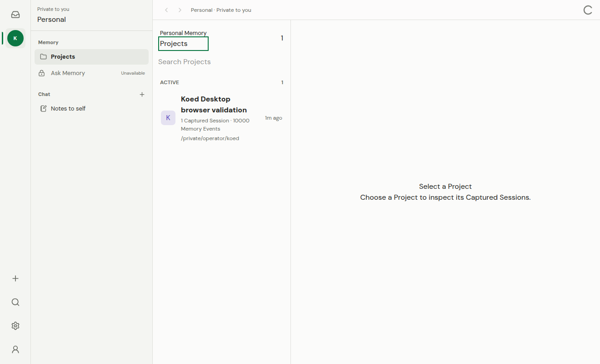
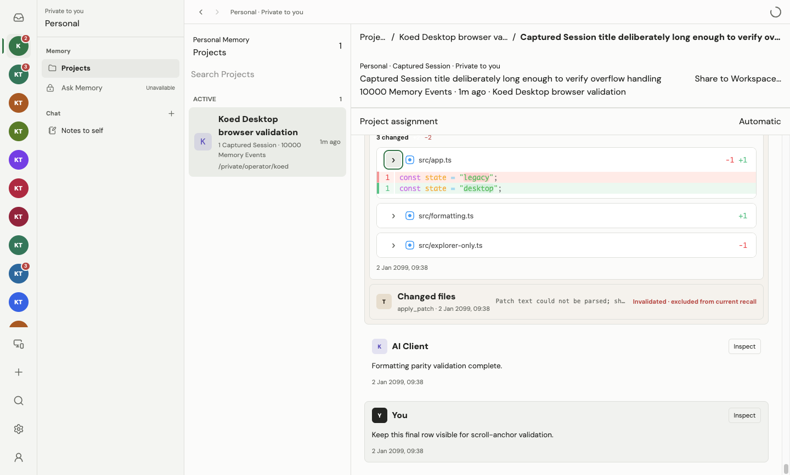
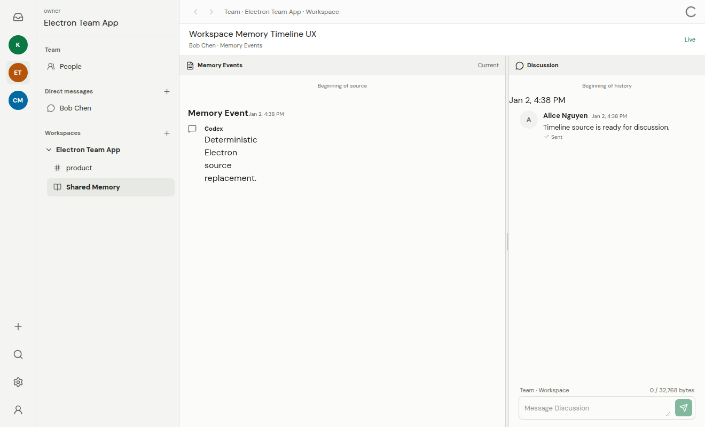
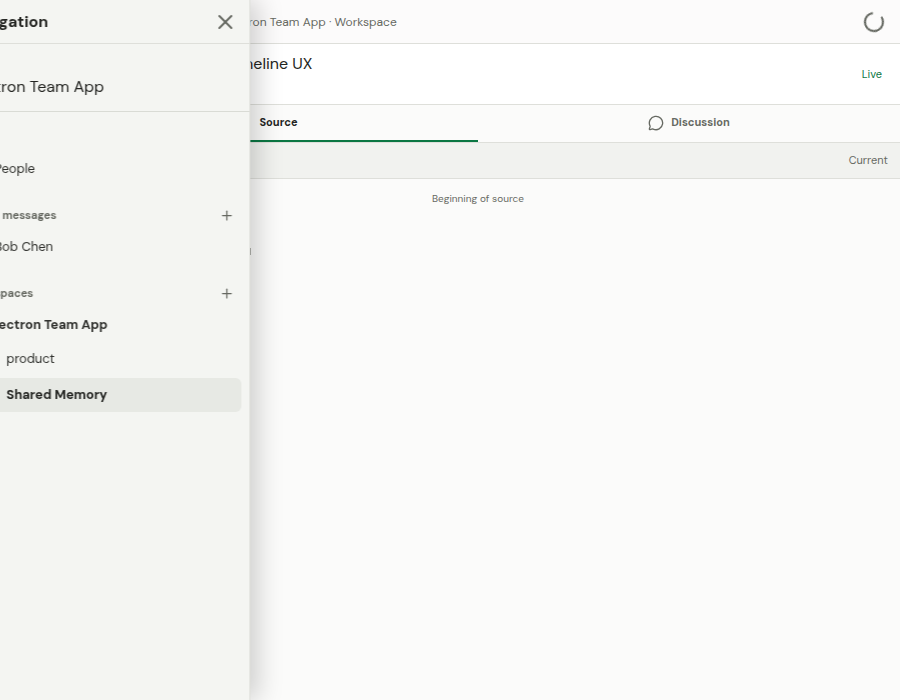
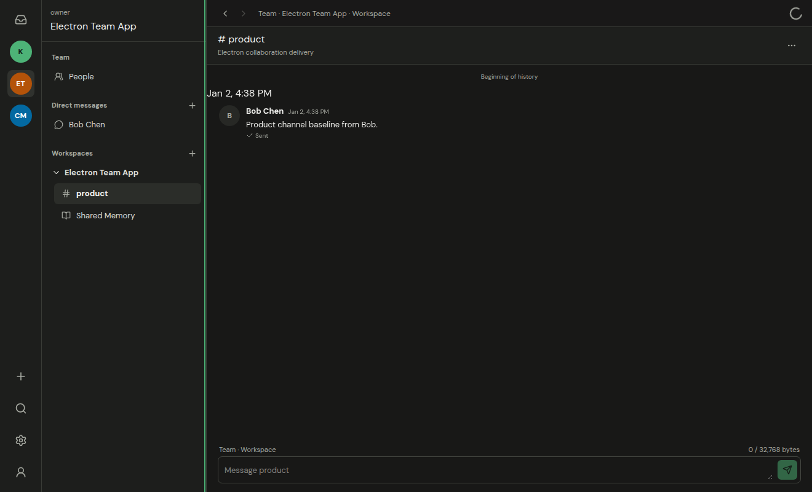

# Koed Desktop

Koed Desktop presents Personal Memory, Personal chat, Team collaboration, and
Team-shared Memory in one application without merging their authority or
lifecycle. This document describes the User-facing model, supported workflows,
recovery behavior, accessibility contract, and tested performance boundaries.

For service and authorization details, see
[Team Collaboration Architecture](team-collaboration.md). For runtime setup and
operation, see [Running Koed](running-koed.md).

On macOS and Linux, Koed Desktop also provides a menu-bar or system-tray
indicator for its managed local services. Activating the Koed mark opens or
focuses the Desktop window. The indicator's context menu shows the current
running-service count and lists only services that are starting, stopped,
unconfigured, unavailable, or need attention. Healthy services are omitted. It
also provides explicit refresh, open, and quit actions. Setup and AI-client
integration diagnostics remain in the full Desktop status surface. On Linux,
the exact activation gesture and indicator location depend on the desktop
environment and its StatusNotifierItem or legacy tray support.

## Information Model

The left rail changes the current principal:

- **Personal** is private to the current local User. It contains Personal
  Memory, Projects, Captured Sessions, Personal Notes, and Personal channels.
- A **Team** is a remote identity and membership boundary. Its navigation
  contains people, Team-scoped direct messages, and Workspaces.
- A **Workspace** is the Team subdivision that contains channels and
  Team-shared Memory.

Every main view includes a scope line. Personal routes say `Private to you`.
Team channels identify the Team and Workspace. Team direct messages identify
the Team. Shared Memory identifies the owner, active representation, freshness,
and destination Workspace.

Captured Sessions and Shared Memory are stored Memory, not chat:

- A Personal Captured Session renders its ordered User, AI Client, tool, and
  invalidation events.
- A shared Captured Session renders exactly one authorized representation:
  Memory Events, LCM leaves, or LCM rollups.
- The companion discussion beside a shared source is Team chat. It does not
  become part of the shared source or appear as an ordinary channel.

## Rich Content And Agent Activity

Personal Captured Session Memory Events and Team Chat messages use the same
secure GFM presentation. It supports headings, nested ordered and unordered
lists, task lists, strikethrough, blockquotes, tables, inline code, and fenced
code. Long code lines and tables scroll inside their own bounded surfaces. A
fenced code block includes a keyboard-accessible copy control with visible
success or failure feedback. Copy and external-link actions always use the
Desktop platform adapters.

Tool Memory Events use a display-safe projection created by trusted Desktop
main-process code. The renderer can receive only a semantic category, label,
bounded preview, allowlisted tool name, status, call identifier, and optional
source patch. It does not receive arbitrary event metadata, credentials,
authorization headers, URLs, or remote authority. Consecutive tools remain in
one **Agent activity** group whose summary identifies commands, file reads,
searches, file changes, and other tools.

Codex guardian decisions with the exact bounded approval-result shape render as
an **Auto approval** row. A leading status icon communicates the outcome, with
compact risk and User authorization signals aligned beside the title and the
rationale presented as prose below. Arbitrary JSON does not receive this
treatment, and Inspect continues to resolve to the original Memory Event.

When a Codex approval-review prompt contains a serialized transcript, Desktop
receives a bounded display-only projection from trusted code. Nested messages
and tools enter the same top-level rich message and Agent activity timeline as
ordinary captured records; ingestion provenance does not select a second card
style. When the approval-review guardian has its referenced parent
Conversation, Desktop suppresses the duplicate guardian Captured Session and
shows the canonical parent Conversation. The bounded projection remains a
fallback for orphaned or legacy records. Projected rows are presentation only
and do not become independent Memory Events or recall evidence; the original
approval request remains retained as inspectable source provenance.

An authorized Shared Memory Events representation enters that same conversation
presentation. The local edge adapts the already-redacted representation items
to the User, AI Client, Agent activity, source-diff, and Auto approval display
contract before they reach React. It does not read the owner's canonical
Personal Memory rows to do so. This local projection keeps the presentation
compatible with older Team backends while preserving the Shared Memory
authorization and representation boundary. LCM leaf and rollup representations
remain summary presentations rather than being made to look like source
conversations.

File-changing tool events recognize Codex patches and standard unified diffs.
Desktop reports per-file additions and deletions, keeps file headers visible,
and permits one file body to be expanded at a time. Unsupported patches keep a
bounded, explained raw-text fallback so no captured content is silently lost.

## Core Workflows

### Connect A Personal Device

Open **Devices** from the account rail. The Authority-hosting installation can
choose **Pair another device** to show a one-use QR code, copyable
private-network link, comparison code, and expiry. The joining device opens
**Devices**, chooses **Join with link**, and waits for the active device on the
Authority host to approve the matching code. Approval remains visibly in
progress until the joining device activates the new membership epoch; there is
no periodic refresh. Joined replicas remain symmetric data-plane sources and
replicas, but direct the User back to the Authority host when another device
must be enrolled.

The renderer sees only display-safe pairing state. It never receives the
browser session, scoped Desktop credential, invitation transport key, device
private keys, or PDS runtime secret. An invitation can be canceled before
approval. After approval commits, Koed completes or reports the membership
transition rather than pretending it can be canceled.

If no Personal Device Group exists, **Set up device sync** first opens a native
save dialog for the encrypted recovery kit. Koed generates a high-entropy
recovery code in the main process, passes it to `koed-server` through an
owner-only temporary file descriptor, and displays it once for the User to
store separately. The modal cannot be dismissed until the User confirms that
the code was saved.

### Find And Share A Prior Decision

1. Select Personal, then open a Project and Captured Session.
2. Review the stored Memory Events and any invalidation labels.
3. Choose **Share to Workspace**.
4. Select the exact Team, Workspace, and representation.
5. Review the source preview. Koed does not silently substitute another
   representation when the requested source is unavailable.
6. Confirm one exact in-app review. Koed records source-owner consent and
   creates the Share Grant as one recoverable bundle; raw Memory Events may
   elevate that exact decision to browser Step-up.
7. Open the resulting entry under the destination Workspace's Shared Memory.

Project-to-Workspace mapping may suggest a destination, but it never grants
access. The share dialog lists every currently writable authorized Workspace.
A newly captured Personal session is immediately eligible when such a
Workspace exists. Desktop derives the initial `not_started` source identity
from the stable Captured Session id instead of waiting for a separate
collaboration snapshot refresh.

### Use Team Chat

Select a Team, then a Team-scoped direct message or Workspace channel. The
composer scope line states the audience. Sends use a durable client idempotency
key. Pending and failed sends remain inspectable in the Inbox; retry does not
create a second logical message.

Opening a thread does not clear unread state. Koed marks it read only after the
last unread row is visible while the window and document are active. Personal,
Team, Workspace, and channel badges use the resulting server-authoritative
unread counts.

Outgoing messages use aggregate receipt icons. One grey tick means sent, two
grey ticks mean delivered to every original recipient, and two green ticks mean
read by every original recipient. Recipient-level activity is not exposed.

### Review Shared Memory Together

A Shared Memory route shows the authorized source and companion discussion in
parallel. At narrow widths it becomes accessible **Source** and
**Discussion** tabs. The source header states:

- owner;
- active representation;
- snapshot or continuous mode;
- current, pending, stale, unavailable, or revoked state; and
- destination Team and Workspace.

The Personal Shares view continues to list an owned Share after the owner loses
Workspace Access. It marks Workspace content unavailable, disables content and
detail actions, and keeps revocation available without exposing the source
preview or companion discussion.

Memory Event bodies and LCM summaries use the same secure rich-text renderer in
the Shared Memory route and the source-owner consent preview. This keeps
headings, lists, tables, links, and fenced code consistent before and after a
source is shared.

Only an authorized source-owner flow can change representation or revoke the
Share Grant. Higher-fidelity cached content is purged immediately when the
grant, Workspace access, Team membership, backend, or remote identity changes.

### Recover From Failure

Personal remains usable when Team connectivity fails. Team routes show
reconnecting or unavailable state and never render stale protected content as
current. Recovery actions are explicit:

| State                                 | User-facing action                                      |
| ------------------------------------- | ------------------------------------------------------- |
| Team Backend unavailable              | Reconnect from Team Connection                          |
| Team access revoked                   | Re-enroll or use another authorized identity            |
| Failed message                        | Retry, copy, or remove the local failed item            |
| Pending message                       | Wait or inspect; removal is unavailable during delivery |
| Share source unavailable              | Restore source/sync authority, then retry review        |
| Shared representation stale           | Retry updates or inspect the last authorized state      |
| Native review waiting                 | Review the authoritative consequence or cancel          |
| Step-up waiting                       | Return to browser approval or cancel                    |
| Action Grant denied, expired, or lost | Start a new exact action                                |
| Captured Session load failed          | Retry without discarding the current selection          |

Disconnecting or changing the Team Backend clears Team drafts, outbox state,
history, recents, selections, Inspector content, cursors, and protected labels.
It does not clear Personal content.

## Action Grants

Protected Desktop operations use a backend-selected tier and one exact Action
Grant. The renderer cannot select or downgrade the tier:

1. **Direct** executes the explicit control with no second ceremony.
2. **Native review** presents the backend-authored title, details, and
   consequence in Desktop, then sends an exact approve/cancel decision.
3. **Step-up** opens the Team Backend's API-hosted, independently authenticated
   browser confirmation.
4. **Bundled stages** retain separate records and audit while sharing the one
   User decision for the surrounding workflow.

Shared Memory preview is Direct. Initial sharing and fidelity changes bind
consent to one Pending Share acceptance. They never prompt for consent as a
standalone stage. Workspace Access selects edit a visible local draft.
**Review and apply** shows each changed value before Native review or Step-up.

The status surface distinguishes native review, browser Step-up, approved, applying, complete,
canceled, denied, expired, and failed. Completion is shown only after the
authoritative mutation and resulting snapshot both succeed. Approval URLs and
reusable credentials never enter renderer state.

## Accessibility

Desktop supports keyboard-only navigation and keeps familiar controls in the
tab order. Team discs use a roving tab stop. Dialogs trap focus and restore it
to the invoker. The Shared Memory divider supports arrow-key resizing, while
the narrow layout exposes a real tablist.

Virtualized timelines report visible ranges and preserve prepend anchors.
Message actions remain available from keyboard focus and an accessible menu,
not hover alone. New activity, send state, connection state, and Action Grant
state use deduplicated live regions. Reduced-motion and forced-colors
preferences are respected.

The supported layout has been checked at 960px minimum width, 200% zoom, long
labels, light and dark themes, and narrow Shared Memory layouts. Normal and
muted text meet WCAG AA contrast against their tested surfaces.

## Performance Boundaries

The Desktop validation fixture enforces these budgets:

- opening a 10,000-event Captured Session must commit its first frame in under
  100ms;
- Team and Workspace context switches must commit in under 100ms;
- a 10,000-row timeline must mount no more than 250 event elements;
- Personal Memory keeps at most 32 warm details for 15 minutes;
- Personal Memory follows the authenticated graph event stream: affected
  Captured Session details are invalidated and the Project index is refreshed
  silently with burst changes coalesced in the renderer. The stream is owned by
  Electron main, so API Tokens never enter React and no periodic refresh is
  used;
- prewarming is limited to 10 recent Captured Sessions with concurrency 2;
- long chat and Memory timelines preserve scroll anchors while paging; and
- pane resizing, 200% zoom, and narrow-window transitions must not create
  document-level horizontal overflow.

These budgets cover renderer work and state growth. Network and embedding
latency are presented as operation state rather than freezing navigation.

## Security Boundary

The renderer receives schema-validated view DTOs through allowlisted preload
IPC. It does not receive API Tokens, upstream device credentials, provider
tokens, browser cookies, approval URLs, general HTTP authority, or decrypted
offline Team caches. Team content is held only while its authority is current.

Markdown uses GFM without raw HTML, permits only safe link protocols, disables
remote images, and rejects oversized input. Clipboard and external-link actions
go through narrow platform adapters. External navigation rejects non-HTTPS
destinations except explicitly supported local development origins.

Renderer restart, replay, backpressure, authorization loss, stale events, and
unknown revocation subscriptions are fail-closed. A revoked or unrecognized
authority purges Team state before another snapshot can render.

The Personal area also provides the protected Ask and Notes workspaces. See
[Personal Ask and Notes](personal-ask-and-notes.md) for the durable workflow,
Local AI Runtime boundary, Recents behavior, and Notes presentation.

## Validation

The deterministic Desktop browser fixture and packaged renderer smoke cover
scope comprehension, long content, responsive behavior, themes,
accessibility, secure Markdown, Action Grant states, durable send failures,
reconnect/replay/backpressure, authorization loss, and protected-state purge.
The Team SaaS synthetic fixture covers backend authorization and Shared Memory
truth. See [Collaboration Launch Validation](collaboration-launch-validation.md)
for the broader launch workflow.

The retirement parity fixture also covers nested and oversized
Markdown, every tool category, grouped activity, multi-file and malformed
patches, keyboard focus, light and dark themes, 200% zoom, reduced motion,
forced colors, and the 10,000-event performance budgets. Desktop owns this
rendering path and has no dependency on the retired browser app.
