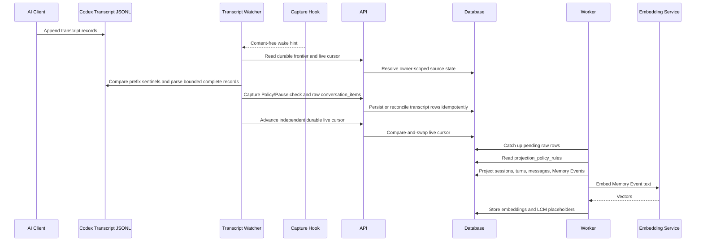
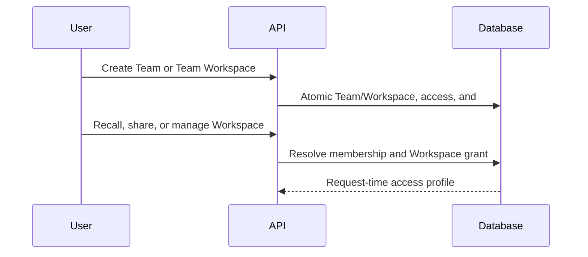
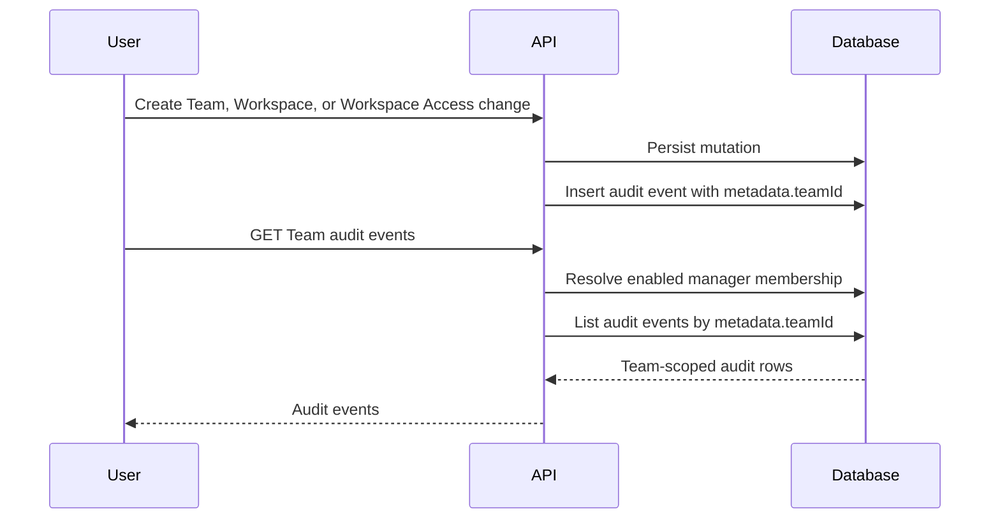
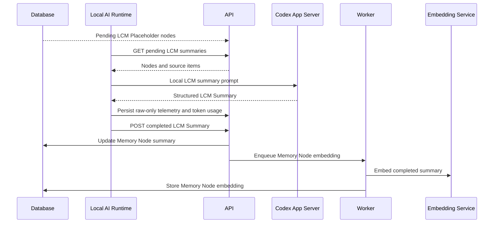
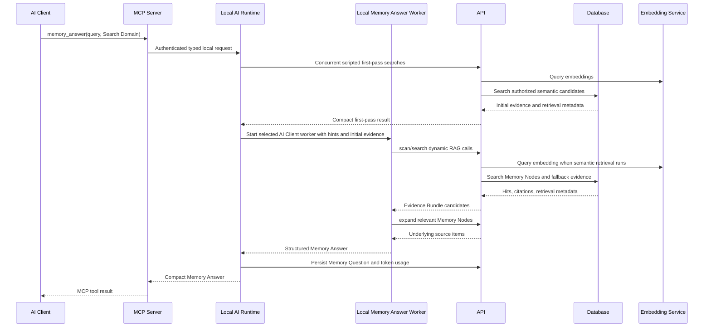

# Service Sequence Overview

This overview describes the high-level service flow for Koed ingestion,
LCM summarisation, and retrieval. It follows the current self-hosted boundary:
the backend stores, projects, embeds, and retrieves memory, while the connected
AI Client performs Answer Synthesis and creates LCM Summaries through the Local
AI Runtime.

## Services In Scope

- **AI Client**: Codex is the supported AI Client in this build.
- **Transcript Watcher**: the local background service that owns correctness for externally managed Codex transcript growth.
- **Capture Hook**: the TypeScript hook that provides content-free, low-latency wake signals.
- **MCP Server**: a thin local MCP `2026-07-28` adapter that exposes Koed tools
  and forwards typed requests to the Local AI Runtime.
- **Local AI Runtime**: the single `koed-server`-supervised process per
  `KOED_HOME` that owns Memory Answer workers, LCM Summary work, Curated Memory
  review, and transcript watching.
- **API**: the Fastify backend that authenticates API Tokens, persists raw
  records, runs Projection, and serves recall endpoints.
- **Worker**: background process that consumes priority-ordered BullMQ or
  Postgres-backed local queue jobs, performs catch-up Projection, embedding
  work, and LCM node embedding. It admits historical batches only after live
  and interactive pressure clears.
- **Embedding Service**: Operator-managed service in external dependency mode, or native Koed-owned runtime in bundled-local mode, that turns memory text into retrieval vectors.
- **Database**: Postgres storage for raw conversation items, projected semantic
  rows, Memory Events, Memory Nodes, embeddings, questions, token usage,
  Team Workspace access records, Team audit events, and commercial encrypted
  field envelopes for human-readable Memory and evidence fields.
- **Koed Server Control Plane**: the local `koed-server` supervisor surface
  that owns `KOED_HOME`, starts Koed app processes, connects to configured
  dependency endpoints, and reports setup/readiness status for headless and
  desktop use on macOS, Linux, and WSL. Native Windows packaged app support is
  not part of this build.

## Local Service Startup

1. The Operator or Koed Desktop starts `koed-server`.
2. `koed-server` resolves `KOED_HOME`, prepares local config/log/runtime
   directories, and
   resolves runtime/dependency mode from explicit environment overrides,
   `KOED_HOME/config/server.json`, or package/profile defaults. Packaged Koed
   Desktop starts its managed local personal `koed-server` with
   `runtimeMode=local-personal` and `dependencyMode=bundled-local` unless the
   Operator overrides those values. Desktop bundled-local startup allocates free
   local API, Postgres, Embedding Service, and private llama-server
   child ports and persists them under `KOED_HOME/config/local-ports.json` for
   stable later launches. This keeps independent Koed homes from attaching to
   each other's model processes. The same
   control plane uses `KOED_HOME/config`, `run`, `logs`, `data`, `models`,
   `cache`, and `runtime` as durable local state.
3. In the current source-checkout path, bare `koed-server` defaults to external
   dependency mode instead of inferring bundled-local from an empty config. The
   Operator starts Postgres/pgvector, Redis/BullMQ, and the Embedding Service
   separately, for example with Docker Compose, and provides explicit
   `DATABASE_URL`, `REDIS_URL`, and `EMBEDDING_SERVICE_URL` values.
   `koed-server` does not start, stop, or inspect Docker Compose in external
   mode.
4. When configured with `dependencyMode: "bundled-local"`, `koed-server start`
   starts native Postgres/pgvector and native Embedding Service runtimes under
   `KOED_HOME`. It does not start Docker Compose. Missing native Postgres,
   Embedding Service entry, llama-server, or model assets report setup guidance through
   `koed-server runtime status/install` and `koed-server models status/install`,
   not repo scripts. It defaults job processing to the Postgres-backed local
   queue. Packaged Desktop can ship platform/architecture native resources plus
   `runtime-asset-manifest.json`; `koed-server runtime install --provider packaged --dependency-mode bundled-local --json`
   verifies SHA-256, executable bits, PostgreSQL 17, `llama-server`, and loader
   dependencies before copying resources into `KOED_HOME/runtime`. For local
   packaged-native smoke, `pnpm native-runtime:stage:homebrew` can create a
   `KOED_NATIVE_RUNTIME_SOURCE_DIR` staging directory from local Homebrew/Linuxbrew
   formulas; this is a development helper rather than a release-quality runtime
   distribution. Python virtualenv files are no longer packaged native runtime
   assets. Packaged Koed
   Desktop also calls `koed-server models status --kind embedding --json` and
   `koed-server models install --kind embedding --json` during first-run local
   personal setup when the embedding model is missing or checksums do not match.
   On macOS, Linux, and WSL, `koed-server runtime status --provider homebrew --json` can
   inspect Homebrew-backed runtime assets without installing packages, and
   `koed-server runtime install --provider homebrew --dependency-mode bundled-local --json`
   explicitly installs missing Homebrew packages and links selected binaries
   under `KOED_HOME/runtime`. Linux packaged native assets target glibc 2.35+
   distributions such as Ubuntu 22.04/Debian 12 or newer; unsupported hosts fail
   with explicit guidance instead of Docker Compose or source-checkout fallback.
   Native Windows packaged app support is not shipped in this build; use WSL for
   local development. Model assets are installed out of band with
   `koed-server models install`, which requires configured artifact URLs and
   SHA-256 checksums before writing to `KOED_HOME/models`. See
   `docs/native-runtime-assets.md`.
5. `pnpm smoke:bundled-local -- --full --install-runtime --json` verifies this
   native path with an isolated temporary `KOED_HOME`, optional Homebrew-backed
   runtime install for that temporary home, temporary host ports, native resource
   preflight, API Token creation, Capture Hook-like personal ingestion,
   Projection, queue/embedding work, Memory Answer evidence retrieval, API
   readiness, and stop-based cleanup before Operators rely on it for local
   development or packaging checks.
6. The API and Worker run as local app processes supervised by
   `koed-server` and connect to those configured dependency URLs. On a
   Desktop-managed fresh start, the supervisor starts the API first, waits for
   API and migration readiness, provisions the app-owned local API Token inside
   `KOED_HOME`, and only then starts Worker with that credential. This ordering prevents authenticated
   background work from ever starting with an example or stale token. API/Worker
   job queues use `WORK_QUEUE_BACKEND=bullmq` for Redis/BullMQ or
   `WORK_QUEUE_BACKEND=local` for the Postgres-backed `local_work_queue`
   table. API and Worker consume the same strict
   `KOED_TEAM_COLLABORATION_ENABLED` setting. When false, the API retains
   Personal notes, channels, realtime, and the local Personal broker, and the
   Worker retains Personal Projection, embedding, LCM, and deletion
   reembedding. Cross-Identity Sync, retention purge, collaboration replay
   pruning, and other Team collaboration jobs are not started.
   After the API is healthy and a local API Token exists, the supervisor starts
   one Local AI Runtime. The runtime hosts the Transcript Watcher when enabled.
7. `koed-server start --daemon --json` starts a detached `koed-server start`
   supervisor and returns machine-readable startup intent for Desktop and
   scripts. `koed-server stop --json` stops supervised processes in
   dependency-safe order: Local AI Runtime, Worker, API, native
   Embedding Service, then native Postgres through `pg_ctl stop`. Stopping the
   Local AI Runtime before the API lets active local work finish or terminate without
   losing the API dependency. Stop treats stale process IDs as an idempotent
   no-op and does not stop Docker Compose or Operator-managed dependencies.
   `koed-server restart --json` runs the same stop lifecycle, starts a detached
   supervisor, and returns machine-readable JSON without streaming startup logs.
8. `koed-server status --json` and `koed-server doctor --json` poll the API
   readiness endpoint, dependency readiness as reported by the API, local
   Worker process state, local API Token configuration, MCP Server doctor
   output, Supported Capture Hook config, Codex config, LCM Summary Service
   availability, and last verification metadata. Status compares the active
   local API URL/token against the Koed-managed Codex MCP block and separately
   verifies the credential-free Capture Hook command path. MCP configuration
   contains `KOED_HOME` rather than API credentials. Stale ports,
   credentials, or runtime paths show as explicit integration mismatches.
   Readiness gates include Postgres reachability and version,
   current migrations, pgvector, local or BullMQ queue backend availability,
   and Embedding Service model/dimension compatibility. Historical-import
   backlog and aggregate Transcript Watcher process/status data are diagnostic
   only, never readiness gates.
9. `koed-server setup codex --json` wraps the existing guided bootstrap path so
   Codex MCP Server, Supported Capture Hook, local API Token, app-provisioned
   local credential, verification, and doctor setup can be invoked through
   the control plane. Setup applies persisted auto-allocated local ports before
   resolving the API URL, so Desktop-managed ports and direct CLI
   setup write the same target URL/token. `koed-server repair codex --json` is
   the narrower Desktop repair path: it rewrites the Koed-managed Codex MCP
   block for the active local API URL/token and the credential-free Hook
   command without
   running the full bootstrap. The managed supervisor is the sole owner of
   Desktop API Token provisioning and rotation. Source and packaged runtimes
   both mint the token through the active runtime repository with the same
   database and token pepper used by the API; Electron main only retains and
   rereads that supervisor-owned credential.
10. Koed Desktop can start/connect to the same headless command surface, run
    the first-launch Codex bootstrap and health-check sequence, poll status,
    offer one-click Codex integration repair for stale local config, and
    provision the embedding model through `koed-server models status/install
--json` in bundled-local mode without requiring the Operator to invoke
    repo-local scripts directly. Its Project and Captured Session navigation is
    native to the Desktop renderer. Selecting a Captured Session requests
    paginated Memory Events from the API and renders the raw Conversation
    in-process; Desktop does not put API Token credentials in navigation URLs.
    Desktop readiness reports API, Worker/queues, and provisioned app-credential
    health so a local service failure is actionable. Desktop manages only its
    local personal `koed-server`; remote, Team
    Self-Hosted, and cloud targets are connect-only.

## Server Deployment Boundary

Server, private VPS, Team Self-Hosted, and Koed-managed cloud deployments are
described as `koed-server` plus dependencies. API, Worker, queue
processors, and diagnostics are implementation surfaces inside that server
boundary. Postgres/pgvector, the selected queue backend, the Embedding Service,
reverse proxy/TLS, and backup/restore jobs are dependencies of the deployment.
This remote/server boundary is not the normal MCP or Capture Hook target when a
User has a local Koed install: Codex MCP Server and Supported Capture Hook
configuration should point at the local `koed-server`, and that local edge
server routes explicitly approved Team Workspace, Share Grant, sync/offload, or
remote capture-bearing operations to the registered upstream.

Local Desktop native setup is distinct: Desktop starts and monitors its managed
local personal `koed-server`, and bundled-local mode may run native Postgres and
Embedding Service resources under `KOED_HOME` without Docker. Source-checkout
Docker Compose remains a dependency starter and example, not the long-term
product boundary. See
[server-deployment-boundary.md](server-deployment-boundary.md) for migration
notes and Linear planning references.

## Capability Discovery

The API exposes `GET /v1/capabilities` as the stable discovery boundary for
clients that can target more than one Koed backend. The endpoint is
unauthenticated and intentionally coarse for this self-hosted distribution: it
does not inspect Memory, emit diagnostics, disclose local paths, or expose
deployment secrets.

Clients should use the capability contract before enabling backend-specific
surfaces. Capability schema version 4 reports the deployment profile, runtime
shape, authentication providers, memory surfaces, commercial gates, entitlement
status shape, security posture, and capability-gated Curated Memory intake for
the current `koed-server` instance.
Supported deployment profiles
are `developer`, `local_personal`, `private_vps`, `team_self_hosted`, and
`koed_managed_cloud`. The profile tells clients which positive surfaces are
available, partial, or unavailable; clients must not infer behavior from
hostnames, ports, package names, or route probing. The public capability
contract is safe for unauthenticated discovery and must not disclose local
paths, secrets, tenant internals, provider configuration, diagnostics, or
Memory content.

Authenticated clients may call `GET /v1/capabilities/authenticated` for the
same versioned contract under session authentication. That authenticated
surface is the extension point for future identity-bound capabilities, device
enrollment, upstream routing, entitlements, and support/admin scopes. WorkOS or
other browser identity providers identify the User, but Koed remains the source
of truth for Memory authorization, Share Grants, Team Workspace access, Access
Suspension, and commercial entitlements.

Authenticated clients may include `teamId` when they need Team-scoped
entitlement and billing state. The response reports only coarse gate data:
entitlement status, whether Team access is allowed, denied operation families,
billing status, over-limit state, and the billing-seat sync state. It also
publishes `commercial.featureGates`, which maps concrete client features such
as Team Workspaces, Share Grants, Memory Inbox, Cross-Identity Sync, hosted
operations, support/admin, and Team limits to capability keys, availability,
entitlement state, billing state, and server-side enforcement status. The stable
entitlement/billing state vocabulary lets Desktop render inactive, trial,
expired, canceled, over-limit, unsupported, and unavailable states without
probing routes. It must not include billing-provider ids, invoices, subscription
internals, raw Memory, provider credentials, or operator-entered private billing
notes. If the User cannot view that Team entitlement gate, the request fails
closed.

WorkOS/AuthKit is advertised only when the backend deployment profile supports
it and the Operator has explicitly enabled AuthKit configuration. `GET
/auth/workos/login` creates a short-lived state cookie and redirects the
browser to AuthKit. `GET /auth/workos/callback` validates that state, exchanges
the returned code with WorkOS, maps the provider user id to a Koed User, and
creates a Koed browser session. Provider access tokens, refresh tokens, API
keys, and OAuth credentials are not stored in Koed identity snapshots. Email is
an identity attribute, not the linking key: an external identity that matches an
existing Koed email but has no provider mapping must fail closed instead of
silently attaching to that account.

The public capability contract includes `auth.enrollment.setupPath` so Desktop
can choose a setup screen without probing routes. Local personal backends report
`local_simple_api_token` for local-only Personal Memory setup, while still
advertising device enrollment as available for registered remote/private/cloud
upstream pairing. Remote/private/cloud backends report
`remote_device_enrollment` when browser-mediated device enrollment is available.
The same block repeats the device-enrollment availability, the personal-only API
Token fallback scope, and the invariant that MCP Server and Supported Capture
Hook configuration should normally target local `koed-server`.

## Route Identity Contract

API routes declare their identity boundary in
`apps/api/src/server/route-identity.ts`, and the same contract is exported
through `GET /openapi.json`. The contract is the source of truth for clients,
tests, and future route review. It distinguishes:

- `public`: unauthenticated discovery or health surfaces.
- `optional_session`: redacted public behavior with additional details for a
  browser-authenticated User.
- `session`: browser/User operations, including Team management, Team
  Workspace management, API Token management, authenticated diagnostics, and
  authenticated capability discovery.
- `api_token`: AI-client compatibility operations for personal Memory capture,
  personal recall, local work queues, and diagnostic smoke tests.
- `session_or_api_token`: personal/local surfaces that are safe through either
  browser session or API Token.
- `session_or_device_credential`: Team-scoped remote-control surfaces that
  accept either a browser session or a scoped enrolled device credential.
  Browser session is the preferred identity for interactive Team operations.
  Device-mediated administration requires the narrow `action_grant` family
  plus an exact, short-lived Action Grant. The Team Backend selects Direct,
  Native review, or independently authenticated browser Step-up from the
  allowlisted action and authoritative current state; the device credential
  never receives reusable `admin` authority.
  For a reviewed Managed Conversation handoff or fork, the enrolled target
  runner obtains its exact source-download authorization through the validated
  operation route without a second interactive approval. That authorization
  remains bound to the initiating operation, source generation, target
  deployment, segment boundary, recipient key, and target device credential.
- `conditional_team_session_or_device`: personal recall/graph routes that
  accept an API Token only for personal scope and require a browser session or
  scoped enrolled device credential for Team Workspace scope. Team semantic
  search, answer evidence, and candidate expansion operate exclusively over the
  selected grant-scoped representation. Generic Team graph routes remain
  unavailable.
- `device_credential`: enrolled local-edge status and remote-operation
  credential checks. Device credentials identify a User, upstream backend, and
  local device; they do not carry Team authority.
- `pds_browser_governance`: browser-session-only Personal Device Group genesis,
  challenge, transition, policy, and Remote Account Link routes. Bearer API
  Tokens and device credentials are denied; active-device/recovery signatures
  remain required in request body and Authority countersigns via configured
  secret provider.
- `upstream_credential` and `internal_service_token`: explicit future
  boundaries that must remain `not_implemented` until the corresponding relay
  or internal-service design exists.

API Tokens remain personal-memory credentials for AI Client compatibility. They
must not carry Team authority, create Share Grants, manage Workspaces, unlock
Shared Memory, or act as a hosted-service credential. Team authority is
resolved at request time from Koed-owned Membership, Team Workspace Access,
Share Grant, lifecycle, profile, and entitlement state. The explicit Shared
Memory list, timeline, detail, realtime, semantic search, answer-evidence, and
candidate-expansion routes apply that boundary to the selected redacted
representation. They cannot treat a Share Grant as authority over canonical
Personal Memory. Generic Team graph routes remain unavailable.

The route contract also exports `x-koed-deployment-modes` for each implemented
OpenAPI operation. This metadata describes where an endpoint is product-applicable
across `developer`, `local_personal`, `private_vps`, `team_self_hosted`, and
`koed_managed_cloud`; it is not an authorization grant and does not replace
`/v1/capabilities`. Clients should use capability discovery for runtime
availability, deployment-mode metadata for documentation and generated-client
applicability, and request-time authorization for actual access decisions.
Team, Team Workspace, entitlement, and invite routes are applicable only to
Team-capable deployment profiles. WorkOS/AuthKit and device-enrollment setup
routes are applicable only to remote Team/cloud profiles. Local-edge relay and
device-credential validation routes are applicable to local edge profiles.

## Operations Status

`GET /ready` remains the machine-readable readiness gate for process
supervision and load balancers. It reports whether core dependencies are ready
enough to serve traffic.

`GET /ops/status` is the authenticated redacted operations snapshot for
Operators. It reports API runtime state, Postgres readiness, migration status,
pgvector, Redis when required, work queue counts, Embedding Service/model
compatibility, request latency/error-rate status from
`KOED_OPS_REQUEST_METRICS_STATUS_PATH` when configured, API process resource
pressure, disk pressure for `KOED_HOME`, and backup freshness when
`KOED_BACKUP_STATUS_PATH` is configured. The endpoint produces alert-shaped
items with optional runbook links from `KOED_RUNBOOK_BASE_URL`; it must not
emit raw Memory, prompts, transcripts, request bodies, provider secrets, API
Tokens, database URLs, or backup object credentials. A missing backup or
request-metrics status file is an operations degradation signal, not a readiness
failure. In hosted-capable profiles (`private_vps`, `team_self_hosted`, and
`koed_managed_cloud`), `/ops/status` and `POST /ops/test-alert` additionally
require the browser-session email to be listed in `KOED_OPS_OPERATOR_EMAILS`
for hosted operations routes, including
`GET /ops/support/teams/{teamId}/overview`. `POST /ops/test-alert` is a
browser-session-only synthetic alert payload for validating alert routing and
runbook links without inducing a real outage. When
`KOED_OPS_ALERT_WEBHOOK_URL` is configured, the test-alert route posts the
redacted alert payload to that webhook using the optional
`KOED_OPS_ALERT_WEBHOOK_TOKEN`; status responses disclose only that the webhook
sink and token are configured, never the URL or token value.

Koed-managed cloud support/admin surfaces use the separate
[Hosted Support And Admin Access Policy](hosted-support-admin-policy.md).
Default support views are redacted operational views. The hosted-operator view
is `GET /ops/support/teams/{teamId}/overview`, requires an allowed ops operator
browser session, records `hosted_operator_redacted` audit metadata, and returns
Team-level identifiers, status, counts, setup/integration health aggregates,
and timestamps only. `POST /ops/support/teams/{teamId}/bundle` packages that
redacted hosted support overview through the shared encrypted package envelope,
requires an envelope provider, expires the package, and writes
`team.hosted_support_bundle.created` audit metadata. The customer-visible
Team-manager view remains
`GET /v1/teams/{teamId}/support/overview`; it requires a browser-session Team
owner/admin and records `team_manager_redacted` audit metadata. Both views link
to support-safe related surfaces such as `/ops/status`, authenticated
capabilities, entitlement, billing-seat, and audit-event routes; global
runtime, queue, backup, and readiness state stay in `/ops/status`. Any
raw-content break-glass flow must be separately scoped, approved, expiring,
audited, and customer-visible; support/admin tooling must not use normal recall
routes as an impersonation path.

Embedding capacity telemetry follows
[ADR 0027](adr/0027-embedding-capacity-telemetry.md). `/ops/status` includes a
redacted Operator snapshot for configured Worker-owned embedding and LCM
compaction-admission queues, measured-token throughput, semantic backlog, the
active capacity profile, and an estimated drain range. These queue counters do
not represent Local AI Runtime LCM Summary synthesis completion. The private `/internal/metrics` surface exports
OpenMetrics-compatible aggregates under a dedicated monitoring credential and
must not be exposed by the public gateway. Neither surface starts calibration;
the Worker performs missing-profile calibration asynchronously after model
readiness using synthetic inputs only.

Hosted backup and restore checks are operator-run workflows. `pnpm
hosted:backup -- create` writes a `pg_dump` custom archive encrypted through
the configured envelope provider (`local_test_key`, `managed_kms`, `byok`, or
`cmek`), a manifest, and a redacted status file. The archive ciphertext lives in
the `.dump.enc` file; the manifest keeps only non-secret envelope metadata. For
encrypted backups, the temporary plaintext dump is removed in failure paths as
well as success paths. `pnpm hosted:backup -- verify` decrypts the archive to a
temporary local file, checks archive readability with `pg_restore --list`, and
deletes the temporary file. `pnpm hosted:backup -- restore-smoke` decrypts the
archive to a temporary local file, restores into an explicit clean disposable
database URL after the Operator repeats the target database name with
`--confirm-restore-smoke-target`, and deletes the temporary file. These commands
feed `/ops/status` through
`KOED_BACKUP_STATUS_PATH`; failed runs write a redacted `status: "error"` status
payload when a status path is configured, so operations alerts do not have to
wait for freshness expiry. Backup commands do not run inside request handling.

Backup creation computes content-free summaries of actual collaboration
threads, messages, encrypted companions, outbox rows, key references, and link
integrity immediately before and after `pg_dump`; source churn fails the backup.
After `pg_restore` and before any synthetic writes, restore-smoke requires the
target summary to match the stored stable source summary exactly, including an
explicit all-zero `empty` state. This proves transport of pre-existing stored
collaboration rows without decrypting customer content.

Encrypted manifests separately carry ciphertext-only synthetic collaboration
sentinels. Once transport comparison passes, restore-smoke seeds them only into
the confirmed disposable target, verifies their schema relationships and key
references, and decrypts through the synthetic owner's authorized selection
with the retained provider key. That second check proves restored schema and
provider decrypt viability, not `pg_dump` transport. Missing summaries,
mismatches, sentinel metadata, or key material fail closed; neither proof
mutates the source database.

Hosted capacity checks are also operator-run workflows. `pnpm hosted:capacity
-- plan` prints the current launch assumptions, and `pnpm hosted:capacity -- run`
exercises public readiness/capability routes, personal capture, personal recall,
Team Workspace authentication denial and unavailable-surface behavior through
browser sessions and scoped device credentials, local-edge Team relay behavior,
graph overview, and `/ops/status`
depending on the selected scenario and available credentials. When
`DATABASE_URL` is available, the harness records before/after database and local
queue snapshots; when a browser session cookie is available, it records redacted
`/ops/status` snapshots. The report includes a launch-gate assessment with
latency and error-rate headroom, failed bottleneck checks, and queue/storage
observations so launch reviewers can attach the result directly to the relevant
validation issue. The harness must not log API Tokens, cookies, device
credentials, database passwords, raw Memory, transcripts, prompts, or provider
secrets.

Hosted activation analytics use `POST /v1/analytics/activation-events`. The
route requires a browser session, accepts only enumerated activation events and
surfaces, checks supplied Team or Workspace IDs against request-time Koed
authorization, and records durable `analytics.activation.*` audit events with
flat scalar metadata only. Metadata uses an explicit low-cardinality allowlist;
string values must be short token-like values rather than free-form text. API
Tokens, device credentials, and MCP Server credentials must not record hosted
product analytics. `GET
/v1/analytics/activation-funnel` returns redacted event-count summaries grouped
by event, surface, and deployment profile. Personal summaries are scoped to the
authenticated User's own activation events; Team or Workspace summaries require
an enabled Team owner/admin and never expose event metadata attributes or raw
Memory.

## Local Edge Upstream Registry

Local edge `koed-server` can register upstream backends for later remote,
private VPS, Team Self-Hosted, or Koed-managed cloud routing. The registry lives
under `KOED_HOME/config/upstream-backends.json` and stores only non-secret
metadata: stable upstream id, display name, base URL, deployment profile,
credential existence/status, route-policy metadata, and a sanitized cache of the
upstream public capability contract.

Remote upstream base URLs must use HTTPS. Exact loopback HTTP targets remain
available for local development, and capability, enrollment, and Memory proxy
requests reject redirects rather than allowing a transport downgrade.

Registering an upstream is not sufficient to route memory traffic. Route policy
defaults are fail-closed for capture-bearing writes, Team Workspace reads,
Share Grant management, sync/offload, and admin operations. `koed-server
upstream refresh --id <id> --json` validates the upstream `/v1/capabilities`
contract and records checked, expiry, schema, profile, release, and failure
metadata. `koed-server upstream policy --id <id> --... enabled --json`
explicitly enables the operation families the Operator has approved. Stale,
failed, and unchecked upstreams show as attention items in `koed-server status
--json` and `doctor --json`. Remote-dependent routing refuses those states
without guessing from hostnames, ports, or route availability.

The API local-edge layer resolves remote routing through explicit route
decisions. `POST /v1/local-edge/route-decisions` uses the upstream registry,
cached capability state, route policy, the User's active device credential
metadata, and the effective Capture Policy where capture-bearing writes are
requested. Personal Memory read/capture stays local unless an upstream id is
explicitly supplied. Remote Team Workspace read, sync, or capture-bearing
actions fail closed when the upstream is missing, route policy is disabled,
capabilities are stale/failed/unchecked, the User has no matching device
credential, or the device credential does not allow the requested operation
family. Share Grant management retains its dedicated family. Team
administration through Desktop uses `action_grant` only to request, poll, and
present exact one-use authority created by fresh browser confirmation; normal
browser-session administration remains available directly.

The typed local-edge search, answer, and node-expansion relays under
`/v1/local-edge/team-memory/*` accept only the per-install Local-Edge Client
Credential, bind it to the selected backend and `team_workspace_read`, validate
the exact request schema, and translate it to a fixed remote Memory route. The
Team Backend applies the complete Workspace, Share Grant, representation, and
lifecycle boundary before semantic search, answer evidence, or candidate
expansion. The relay does not create authority. Local edge resolves the separate
upstream device credential from secret storage and never forwards the local
credential, arbitrary paths, methods, browser headers, or reusable credentials.
Chat, Shared Memory, Team lifecycle, and realtime use their own typed
collaboration controls; there is no general local-edge HTTP proxy.
Cross-Identity Sync uses a typed `queued_sync_handoff` route decision, durable
source outbox and target inbox processing, resumable encrypted upload sessions,
bounded chunks, and idempotent target apply. Its state model records logical
Memory identity, source and target replicas, sync relationships, cursors,
package state, and inbox/outbox entries independently from Share Grants.

For MCP Team recall, the incoming `Koed-Device` value is a Local-Edge Client
Credential created during enrollment and scoped to the selected backend plus
`team_workspace_read`. It is not the upstream device credential. The local edge
validates the local credential before opening secure storage for the separate
upstream credential. Personal API Tokens remain on Personal Memory routes and
cannot be promoted into Team authority from the requested operation body.

## Desktop Auth And Device Enrollment

Koed Desktop is the setup and inspection surface for local, private VPS, Team
Self-Hosted, and Koed-managed cloud targets. The retired Explorer-first design
is recorded as historical context in
[ADR 0008](adr/0008-explorer-first-auth-and-device-enrollment.md).

Local personal setup may keep app-provisioned API Tokens for AI-client
compatibility. Cloud and Team setup must guide the User through browser session
auth and, where supported, browser-mediated device enrollment. Browser sessions,
API Tokens, device credentials, upstream credentials, and WorkOS/AuthKit server
secrets are distinct credential classes. API Tokens stay personal-memory
credentials and do not carry Team authority. Device credentials identify an
enrolled local edge and upstream, but all Team Membership, Workspace Access,
Share Grant, lifecycle, and entitlement decisions remain request-time Koed
authorization checks.

Browser-mediated device enrollment uses local-edge routes, not API Tokens. The
local edge creates a short-lived enrollment challenge with
`POST /v1/local-edge/device-enrollments/challenges` and opens
`GET /device-enrollment/{challengeId}` on the Team Backend API origin. The API-
hosted page reviews the bounded context through
`GET /v1/local-edge/device-enrollments/challenges/{challengeId}` and can approve
or deny the challenge through
`POST /v1/local-edge/device-enrollments/challenges/{challengeId}/approval`;
approval binds a device credential to the User, upstream backend, device
instance, operation families, and server-side verifier material, while denial
consumes the challenge. For shared-secret credentials, the client submits a
fresh device secret over the browser-authenticated enrollment channel and the
server hashes it with server-side secret material before persistence. The older
direct redemption route `POST /v1/local-edge/device-enrollments/credentials`
remains available for headless/browser-mediated exchanges that already have
session auth. Server-side persistence stores only verifier hashes or public-key
material, never reusable device secrets. `GET
/v1/local-edge/device-credentials/status` accepts the `Koed-Device` credential
scheme for credential validation. Browser sessions can list and revoke any of
the User's enrolled credentials, while `DELETE
/v1/local-edge/device-credentials/current` lets a local edge revoke only its
currently authenticated credential during an explicit disconnect. Revoking a
device credential stops future device-credential authentication without
rotating local personal API Tokens. A local edge keeps its secure credential and
route state unchanged when remote revocation cannot be confirmed, so the User
can retry without leaving an untracked remote credential.

Step-up Action Grants follow the same deployment boundary. Desktop resolves
the backend-provided `/high-risk/browser-activations/{selector}` path against
the registered backend and opens it in the system browser. The API-hosted page
uses the authenticated `/v1/high-risk/browser-activations/{selector}` JSON
endpoint for review and the corresponding `/decision` endpoint for one explicit
approve or deny choice. Only a freshly authenticated matching User can decide;
API Tokens and device credentials cannot inspect or decide the activation.

Device credential metadata records created, updated, last-used, last-validated,
expiry, and revocation state. Audit events record credential creation and
revocation without verifier hashes, challenge hashes, public keys, reusable
secrets, or Team authority. Diagnostics may show credential existence, status,
and timestamps only. Detached Capture Hook child processes inherit local
capture configuration but scrub upstream/cloud/device credential environment
variables so MCP Server and Supported Capture Hook execution never receive
remote credential material directly.

## Team Entitlement And Access Suspension Gates

Team entitlement state is a request-time lifecycle gate on Team and Team
Workspace behavior. The current coarse states are `active`, `grace`,
`suspended`, and `revoked`. `active` and `grace` allow normal Shared Memory
views, sharing, ingestion, sync handoff, and Team admin flows. `suspended` and
`revoked` deny those Team operation families without deleting Users, Teams,
Workspaces, Share Grants, or retained Memory rows.

The gate is enforced alongside existing Team Membership, Workspace Access,
Workspace archive, and Share Grant checks; it does not replace them. Repository
authorization returns coarse gate status for later capability discovery and
billing integration, while public capability responses remain owned by the
capability-discovery work. Entitlement changes emit Team audit events with
previous/current status, reason, and denied operation families only; they must
not include Memory content, API Tokens, provider credentials, or billing
secrets.

Team billing seat state is stored separately from provider-specific billing
integration. Membership enablement, invite acceptance, and member disablement
reconcile billable seat counts transactionally and emit redacted Team audit
events. Generic member-management routes reject self-directed role/status
changes and must not remove the last enabled owner from the Team. Seat overage
records an explicit `over_limit` state and may move the Team into `grace` with
`seat_limit_exceeded`; reducing seats back within the configured limit restores
only that seat-caused grace state. External billing provider synchronization
remains a later integration on top of this durable seat lifecycle state.

## Ingestion

1. The supervised Transcript Watcher combines recursive filesystem notification
   hints with bounded periodic rescans of explicit Codex transcript roots. The
   default root is `CODEX_HOME/sessions`; path-delimited
   `MEMORY_CODEX_TRANSCRIPT_ROOTS` replaces it. Notifications only reduce
   latency: missed notifications still converge through rescans.
2. The first successful bounded full discovery cycle establishes activation. Files in that
   baseline register an immutable complete-record frontier and leave their
   prefix to historical import. A file created after
   activation registers frontier zero and is live from its first complete
   record. Restart resumes post-frontier growth from the durable live cursor,
   never from the independent historical checkpoint.
3. Before reading a page, the watcher validates file size and compares bounded
   SHA-256 first/last cursor-prefix sentinels. It reads only complete JSONL
   records within bounded file, entry, and byte limits. Partial trailing records
   hold the cursor; malformed complete records, truncation, and sentinel-covered
   prefix mutation fail visibly without advancing it. Mutations outside sentinel
   windows are intentionally not detected by this bounded check.
4. Codex may also emit `SessionStart`, `UserPromptSubmit`, `PostToolUse`, `Stop`,
   `SubagentStart`, and `SubagentStop`. The Supported Capture Hook writes only a
   content-free local wake hint. Stop events additionally record the exact
   complete JSONL byte frontier under hashed source-routing identities. The
   watcher journals through that frontier and writes one idempotent,
   server-validated lifecycle control for the active transcript turn before
   consuming newer bytes. The Hook never supplies semantic content or provider
   item identity, and the control cannot render or embed. Missing signals may
   delay a fallback seal; duplicate, delayed, or reordered signals cannot seal
   a later frontier or create duplicate content. Transcript JSONL remains the
   content, provider item identity, and chronology source of truth.
5. The watcher checks Capture Policy and Capture Pause before session creation
   and before every batch, then converts records with `codex-transcript-v1` into
   canonical `conversation_items` plus immutable
   `conversation_item_observations`. The API authenticates the Personal API
   Token and persists each raw batch as Personal Memory. No Team Workspace,
   Share Grant, remote authority, or backend synthesis is introduced.
6. Exact provider identity controls canonicalization across live watcher,
   managed ingestion, and historical import. Replayed observations are
   idempotent, conflicting bytes fail, and a later live observation promotes
   work to live Projection priority without another canonical item or Memory
   Event. Cursor advancement occurs only after raw persistence and direct live
   Projection succeed.
7. Projection reads `projection_policy_rules` to decide which Codex transcript
   item types become UI rows, tool events, Memory Events, embeddings, and LCM
   sources. The seeded policy projects user, agent, subagent, tool call/result,
   and reasoning summary items; context, telemetry, raw reasoning, lifecycle,
   and unknown items remain raw provenance only.
8. Projection derives Koed semantic rows: Captured Sessions, turns, messages,
   tool events, Memory Events, source links, and token usage where available.
   Agent work is bundled into semantic `agent_turn` Memory Events only when a
   seal condition is reached. When a commercial envelope provider is configured,
   raw `conversation_items`, projected message/tool payloads, projected
   Memory Event payloads, Memory Node text/source fields, embedding source
   text receive encrypted field companions with owner, visibility, source
   table, source column, provider, and key metadata when the deployment profile
   requires them. Memory Question query/answer/evidence/worker payloads always
   use encrypted field companions in every profile. In paid Koed-managed cloud, new raw
   conversation-item rows store redacted operational source fields; Projection
   hydrates the raw source companions inside the repository boundary before
   deriving semantic rows. New message, tool-event, Memory Event, Memory Node,
   embedding, and Memory Question rows also store redacted operational payloads,
   and repository read paths hydrate authorized graph, embedding, retrieval,
   LCM source content, and Memory Question payloads from encrypted companions
   after access checks. Memory Question history applies metadata filters and
   pagination before decrypting the bounded result page; it does not offer
   server-side text filtering or scan decrypted history for matches.
9. Projection persists an identifier-only processing outbox before raw rows are
   marked projected. API and Worker queue producers use deterministic job ids
   and acknowledge each outbox row only after its policy-eligible embedding and
   compaction jobs are admitted. Worker catch-up replays unacknowledged rows
   after queue failures or restart. Queue payloads hold only identifiers plus
   one work class: interactive Recall/Memory Questions, live Capture Projection,
   normal embedding/LCM, or historical import/backfill.
10. Direct API Projection selects only live rows. The Worker also selects live
    rows first. Historical rows have the durable
    `historical_import_backfill` Projection class and are selected only as one
    bounded batch when API readiness, queue, and Embedding Service probes are
    healthy and configured live/interactive pressure thresholds are clear.
    Physical row/payload-byte limits and runtime checks apply at completed-turn
    segment boundaries. A Postgres advisory lease permits one historical batch
    across Worker processes. It yields after each batch and reevaluates after
    restart.
11. The Worker independently derives missing embedding jobs and pending LCM
    compaction scopes from PostgreSQL. Deterministic queue identities make this
    reconciliation idempotent, so outbox admission failure, exhausted retries,
    or restart cannot permanently strand work or promote historical work into
    the normal class. Embedding reconciliation accepts only complete active
    chunk sets for current source version. LCM dispatch is bounded per owner and
    work class; compaction selects only Memory Events with the requested durable
    lineage. Created leaves and rollups persist that lineage, and derived node
    embeddings retain it.
12. Local historical import state uses authenticated
    `/v1/historical-imports` and `/v1/historical-import-sources` routes. A
    strict local-only lookup resolves one owner-scoped Conversation Source
    Artifact from its AI Client, source kind, and provider session ID. These
    routes exist only on developer/local-personal edges. Durable run/source
    records validate transitions and retain the immutable registration
    frontier, separate historical ranges and journal consumer cursor, stage
    counters, retry/failure timestamps, and immutable detected Project
    provenance. Raw source paths remain local process state and are never
    persisted or returned. New sources can be registered only while a run is
    active or paused; completed, failed, and skipped runs reject registration
    transactionally.
13. Before source eligibility/queueing and every import batch, API resolves
    owning User's effective Capture Policy and Capture Pause. Disabled, ask,
    paused, or non-personal results fail closed. Policy mutation is serialized
    against batch persistence. Batch writes use the same
    `codex-transcript-v1` journal consumer and `conversation_items` path as live
    capture.
    The boundary accepts canonical response-item identity, immutable observation
    fields, observation-only records, and raw-only classifications without
    rewriting them; raw persistence, counters, and checkpoint advancement
    commit atomically. Offset/prefix-hash
    retries distinguish exact replay from sentinel-covered mutation, rotation, or truncation.
    Pre-frontier records are historical; post-frontier/downtime-recovery records
    are live. No Team,
    Workspace Access, or Share Grant mutation occurs.
14. Worker consumes queued jobs from Redis/BullMQ or `local_work_queue`.
    Both backends use lower-number-first priority and FIFO as the current
    within-class tie-breaker, so
    live capture runs ahead of queued historical embedding/LCM work. Schema
    upgrades assign existing local jobs normal priority. Before BullMQ workers
    start, Koed assigns same normal priority to legacy waiting, paused, and
    delayed jobs that have no stored priority. Aging, token-cost fairness,
    per-User/tenant shares, reserved interactive capacity, and dynamic dispatch
    priority are deferred to KOE-355.
15. Worker embeds Memory Events by calling Embedding Service and atomically
    replaces source's complete embedding chunk set.
16. Worker schedules compaction, creating or updating LCM Placeholder Memory
    Nodes from Memory Events and child nodes, then queues Memory Node embedding.
    In paid Koed-managed cloud, placeholder summaries, body text, source item
    JSON, completed LCM summaries, and structured LCM summary JSON are stored as
    redacted Memory Node fields with encrypted companions.
17. Pending LCM placeholders remain available as degraded evidence until local
    LCM summaries are submitted.

### Experimental Koed-managed Codex threads

For a Koed-managed thread, local `koed-server` owns a persistent Codex
app-server stdio connection. Before starting it, the source adapter verifies the
installed binary's generated protocol schema. Stable item lifecycle events are
persisted immediately as source observations of canonical conversation items;
completed item payloads are preferred over started snapshots. App-server source
time and Koed observation time remain separate.

Koed assigns each managed prompt a `clientUserMessageId`, which is the exact
shared user-item identity in app-server and JSONL. Role-user response records
without that id are retained as raw-only context because Codex uses that shape
for injected setup data as well as rendered prompt copies.

Managed canonical rows are held outside the worker backlog. At turn completion,
Koed first reconciles the persisted JSONL rollout. JSONL records attach to the
same canonical keys, provide transcript-only context and chronology, and
recover missed lifecycle notifications. Only after that pass and terminal
verification from a persisted `task_complete` or `turn_aborted` record does the
API release the full turn for Projection. Projection orders that control after
all non-control items in the same turn and orders tool calls before their
results even when source times or source sequence spaces differ. A restarted
coordinator reuses the durable isolated Codex home and atomic transcript
checkpoint, resumes by provider thread id, verifies the rollout path,
revalidates the existing Captured Session, and runs the same reconciliation.
The common Projection, embedding, LCM, encryption, retention, and sync paths
receive only canonical rows and do not know whether app-server or JSONL was the
first observation.

When app-server reports a child `thread/started`, Koed creates a linked child
Captured Session and reconciles that child's rollout independently. Parent and
child turns use the same terminal-evidence requirement and remain distinct
through Projection and downstream memory.

This path currently has no frontend and does not replace the Transcript Watcher.
Threads started outside Koed are captured from transcript growth; Supported
Capture Hook signals only reduce watcher latency.

Commercial/private VPS/Team deployments can run encrypted-field backfill over
existing human-readable Memory and evidence columns. Backfill is whitelist-based
per source table/column, skips already-encrypted fields, records resumable
cursors and counts, and fails closed when the configured envelope provider or
key cannot encrypt the next field. The provider boundary supports
`local_test_key` for local/operator-managed use and KMS-backed modes
(`managed_kms`, `byok`, or `cmek`) for paid Koed-managed cloud. Paid cloud must
delegate DEK wrap/unwrap to KMS and may rewrap DEKs to the current key version
without rewriting payload bytes by running `pnpm hosted:encryption-rewrap` in
bounded batches. `operator_kms` is reserved until a real
operator KMS adapter exists. BYOK and CMEK use the same KMS provider path with
customer-controlled key references; if that key access is revoked, suspended,
unreachable, or denied, decrypt-dependent recall, evidence, export, support,
sync, backup, and restore paths fail closed for affected payloads.
Decrypted values must not be written to queue payloads, audit metadata, status
responses, logs, or diagnostics.

Raw-ingestion validation treats tool names as bounded source-protocol
identifiers rather than classification tokens. In particular, a tool name may
begin with an underscore and is preserved exactly for Projection and rendering.
Other provider IDs, hashes, and classification fields retain their separate
schemas. A rejected batch does not advance the Transcript Watcher's durable
cursor, so corrected validation or source data is replayed without skipping
later records.

## Team Workspace Access Foundation

The Team SaaS storage foundation keeps Memory ownership separate from
Team Workspace visibility. Team membership identifies whether a User can manage
team-level settings, while a Team Workspace access grant controls whether that
User can recall from, share into, or manage a specific Team Workspace.

1. Team creation atomically stores the Team, owner membership, exactly one
   default Workspace, and exactly one structural `#general` channel. Retrying
   the same idempotency key returns that completed Team without creating more
   default records.
2. A User with enabled owner/admin membership may create another Team
   Workspace. Workspace creation always stores one structural `#general`; there
   is no caller-controlled omission option.
3. The API stores each `team_workspaces` row, creator self-grant with `write`
   access, and structural `#general` in one transaction.
4. Workspace access checks resolve enabled membership and the Workspace grant at
   request time. A missing grant is treated as `disabled`.
5. Recall and share decisions use the resolved Workspace grant: `read` can
   recall, `write` can recall and create shares, and `disabled` can do neither.
6. Workspace grant management requires both enabled owner/admin membership and a
   `write` grant on that Team Workspace, so Workspace-level downgrades take
   effect without rotating credentials.

## Team Audit Log

Team audit events record Team and Workspace control-plane changes without
copying or re-owning Memory. The audit surface is manager-only and scoped by
Team id stored in audit metadata, so Team managers can inspect Team changes
without gaining direct access to unrelated personal records.

1. Team creation writes an audit event with `metadata.teamId` set to the new
   Team id.
2. Team Workspace creation writes an audit event after the Workspace row and
   creator access grant are persisted.
3. Workspace Access create, update, and removal flows write audit events after
   the access mutation is stored.
4. A User requests `GET /v1/teams/:teamId/audit-events`.
5. The API authenticates the User session, resolves Team Membership, and allows
   the listing only for enabled Team managers.
6. The repository lists audit rows whose `metadata.teamId` matches the
   requested Team id, optionally filtered by action and limit.
7. The API returns audit records without exposing sensitive invite or password
   fields in metadata.

## LCM Summarisation

1. Projection and compaction create LCM Placeholder Memory Nodes from
   token-bounded Memory Event spans or lower-level Memory Nodes.
2. The Local AI Runtime starts the LCM Summary Service on a timer and can also
   nudge it after capture.
3. The LCM Summary Service asks the API for pending session titles and pending
   LCM summaries.
4. The API returns LCM nodes plus ordered source items and marks the work as
   local-only; the backend does not call an LLM for LCM summaries. If the node
   is encrypted at rest, the repository hydrates source items and child
   summaries only after the caller has passed the visibility boundary.
5. The local LCM worker builds token-bounded prompts from exact source items or
   child summaries. The prompt requires secret-like literal redaction and, when
   ordered source items or child summaries conflict, prefers later items while
   preserving older conflicts only as superseded context. `@koed/core` owns the
   `lcm-semantic-summary-v1` schema and parser shared by the DB, MCP Server, and
   evaluation suites. LCM summaries use a JSON envelope containing a title,
   one canonical `summary_text`, and a bounded `lexical_anchors` list selected
   by the LLM.
   That text contains every parent-relevant semantic fact: leaves describe each
   distinct topic briefly, while rollups compress complete child summary
   envelopes into broader themes. Detailed commands, logs, filenames,
   identifiers, provenance, and intermediate steps remain in child summaries
   and source Memory Events for drill-down unless a detail is needed to
   understand, distinguish, or retrieve the topic. Completed child payloads
   must match the current semantic-summary contract; this alpha contract is
   replaced in place and fresh/reset data is assumed. Only a legitimate
   pending child without completed structured output is wrapped as a
   deterministic placeholder for parent summarisation.
   For leaves, every proposed lexical anchor must be an exact, contiguous,
   case-sensitive substring of the exact source payload supplied to the LLM.
   For rollups and token-bounded reductions, the supplied child or shard JSON
   includes its already validated anchors, while grounding checks use the
   actual child `summary_text` and validated anchor values before JSON escaping.
   Quotes, backslashes, and newlines therefore retain their original values
   instead of being validated against serialized escape sequences.
   Koed exact-deduplicates anchors and enforces count and length limits, but
   measures anchor length in Unicode code points rather than UTF-16 code units.
   It
   does not extract or classify anchors with regexes or scripts. Rejections are
   reported to the LLM for one repair attempt. A partial repair retains the
   valid summary and valid grounded anchors and drops anything still invalid.
   Other unsupported worker output fails at the worker boundary.
6. The LCM worker runs the selected local AI Client. Codex uses app-server mode;
   Claude uses the pinned Agent SDK and confirmed local Claude Code executable.
   The worker parses the returned structured LCM Summary.
7. App-server workflow telemetry is persisted as raw-only conversation items,
   and provider token usage is recorded for attribution.
8. The LCM worker submits the completed LCM Summary to
   `POST /v1/memory/lcm/summaries/{nodeId}`. The API requires the shared
   semantic-summary schema, matching schema-version metadata, and canonical
   `summaryText` consistent with structured `summary_text`. After authenticating
   the caller and hydrating the visible node sources, the API independently
   enforces that every submitted lexical anchor is an exact, contiguous,
   case-sensitive substring of a supplied source payload. Worker-side repair is
   therefore not the trust boundary for anchor grounding.
9. The API updates the Memory Node summary fields and enqueues Memory Node
   embedding. In paid Koed-managed cloud, the stored summary/body/structured
   JSON fields remain redacted and the submitted LCM Summary, including its
   lexical anchors, is written to encrypted companions. If a completed child
   summary or its lexical anchors change, the same transaction requeues every
   completed ancestor rollup transitively and invalidates their embeddings so
   no completed ancestor remains current against stale child input.
10. The Worker embeds the updated Memory Node so retrieval can use the
    completed summary. Validated anchors are appended in a separate
    `Lexical anchors:` section of the embedding input. The embedding source hash
    includes both this composition epoch and the Memory Node summary revision.
    Embedding writes compare-and-set that revision while holding a database row
    lock, so an in-flight vector for an older summary-plus-anchor composition
    cannot become current after regeneration.

LCM prompt versions are forward-only. A new prompt version applies to newly
created placeholders and nodes that are naturally invalidated and rebuilt; it
does not automatically regenerate already completed summaries.
`lcm-semantic-summary-v1` is the release-V1 semantic payload shape for this
alpha product; it is intentionally not renamed when the pre-release shape is
replaced. Generation compatibility is recorded separately in
`summary_model`, `summary_prompt_version`, and
`summary_structured_schema_version`; embedding compatibility is recorded by
the embedding model/version fields plus the composition epoch and summary
revision in `source_hash`. Existing local data whose completed structured JSON
does not match release V1 must be reset or explicitly regenerated. Koed does
not reinterpret or migrate an incompatible completed payload at read time.

## Team Sharing

Team-shared Memory remains user-owned. Sharing is represented by a Share Grant
from a user-owned memory source to one Team and one Workspace. The first
implemented source type is a Captured Session. A Workspace is the stable shared
ID for memories; Project context such as local repo, filepath, ref, branch, or
cwd is used only to resolve or display a Workspace.

1. The User selects a user-owned memory source, Team, Workspace, and expansion
   level. In the first implementation the source is a Captured Session.
2. The API authenticates the browser session as the owning User.
3. The API verifies Team Membership and Workspace Access for the User.
4. The API creates or revokes the Share Grant and writes an audit event.
   Captured Session grants are managed through browser-session Team Workspace
   routes; API Tokens remain personal-memory credentials and cannot create,
   list, or revoke Team Share Grants. Team creation atomically establishes the
   initial Team retention policy. Share Grant revocation removes access and
   atomically creates the immutable grant-scoped retention decision, purge job,
   and artifact inventory; later purge remains a separate Worker operation.
5. Shared Memory list, timeline, detail, realtime, semantic search, answer
   evidence, and candidate expansion use the exact active grant-scoped
   representation plus independent lifecycle gates for Access Suspension,
   Workspace archive state, membership state, and Workspace Access. Generic
   graph and export do not inherit Share Grant authority.
6. Materialization inserts pending plaintext-free semantic item metadata. The
   Worker reconciles it asynchronously: all grant, consent, policy,
   representation, replica, sync, Team, and Workspace metadata joins complete
   before it decrypts one precise already-redacted representation item for the
   Embedding Service. Search applies the same joins before candidate decrypt;
   exact hints are checked only over those semantic candidates. Replacement,
   revocation, or policy invalidation deletes the derived vector rows.
7. Personal deletion removes memory from the owner's Personal Memory recall
   surface through `personal_deleted_at` lifecycle markers. It is not the same
   as global invalidation and does not revoke an active Team / Workspace Share
   Grant in the first version.
8. If local Project metadata is supplied during recall, Koed may use an exact
   Project root or device-local Project id from an explicit Project-to-Workspace
   link. Worktrees keep separate local ids and share only a salted local Git
   common-directory signal. Current and historical remote aliases are
   non-authoritative matching evidence for future trusted personal-device
   association; they cannot select or authorize a Workspace.
9. Archived search is an explicit mode, not the default active recall path. It
   may include retained Workspaces only when the caller and retention policy
   allow it. Access-suspended Team data belongs to a separate admin, legal, or
   Operator mode, not ordinary archived search.
10. A retained Team session Share Grant keeps references to the owning User and
    Captured Session nullable rather than cascading. User account deletion is
    represented by a User tombstone, and retained Team knowledge remains tied to
    the Team and Workspace retention record for audit, restore, and future
    authorized Team recall.
11. Team-visible derived memory is built only from source items inside the
    authorized Team and Workspace boundary. Private personal summaries, graph
    edges, embeddings, or rollups cannot become Team-visible by label change
    when they include unrelated private source material.
12. Creating a Captured Session Share Grant is idempotent for an active
    session / Workspace pair, so repeated client submissions return the
    existing active grant instead of creating duplicate Team visibility.
13. Listing grants requires current Workspace recall access. Creating grants
    requires current Workspace share access and ownership of the Captured
    Session. Revocation is allowed by a current Workspace sharer or by the
    original source owner, preserving a User-controlled privacy exit even if
    their Workspace grant later changes.
14. Exact Conversation source bytes remain owner-private unless the owner adds
    a separate Conversation Source Access grant to the active Captured Session
    Share Grant. Semantic expansion level never implies source access.
15. Snapshot source access pins one verified artifact frontier. Continuous
    source access follows verified generations for the same logical source and
    publishes metadata-only SSE wake events; each manifest and segment read is
    independently reauthorized.
16. A Team member may request a bounded fork snapshot ending at a completed
    turn boundary through a fresh browser session. The export does not mutate
    the owner's Conversation or create a Koed-side Conversation automatically.

Team chat is a separate collaboration path even when Desktop presents it beside
Team-shared Captured Sessions. Team Chat Messages use dedicated encrypted tables
and durable content-safe outbox events; they do not enter raw ingestion,
Projection, LCM, embedding, or recall. Local-edge Team chat uses separately
scoped `team_chat_read` and `team_chat_write` device operations and the same
request-time Team Membership, Workspace Access, lifecycle, and entitlement
boundaries. See [Team Collaboration Architecture](team-collaboration.md).

## Cross-Identity Sync And Offload

Cross-Identity Sync covers cases where the same logical memory lifespan must be
available across identities or deployments, such as a personal Koed identity
and a Team-side personal identity. It is not a fork or import. A policy-aware
synced replica may exist for availability, indexing, and Team recall, but the
product treats it as the same logical memory lifespan until an explicit
Fork/Import operation is introduced.

1. The source identity authorizes sync of a memory source to a target identity
   or deployment.
2. The target side stores enough synced source material, provenance, and sync
   state to support recall even when the source device is temporarily offline.
3. Team sharing from the target identity still requires a Share Grant and the
   caller's current Team Membership and Workspace Access.
4. Sync revocation stops future propagation. Data already made Team-visible is
   then governed by the target Team, Workspace, Share Grant, and retention
   policy.
5. Fork/Import remains a separate future operation for intentionally creating a
   new, independently evolving memory lifespan.
6. Offload moves storage or processing to a hosted Koed service; it does not by
   itself grant Team visibility or create a fork.
7. Durable sync/offload state is stored separately from Share Grants. The
   schema distinguishes the logical memory lifespan from physical deployment
   replicas, records Captured Session as the first supported V1 source
   boundary, stores policy/consent/cursor manifests, and uses idempotency keys
   on relationships, upload sessions, chunks, and inbox/outbox entries.
8. Retrying sync package creation, chunk upload, or queue insertion must resume
   the same records rather than creating another logical memory or fork.
9. Sync/offload upload sessions must store a redacted encrypted package
   manifest. Payload bytes live only in the encrypted package envelope or in
   encrypted object storage; package manifests, queue metadata, logs, and
   status surfaces must not contain raw Memory, source payloads, credentials,
   raw DEKs, wrapped DEK ciphertext, or plaintext-equivalent vectors.
   Upload-session creation validates the exact object class, protocol format
   and version, package digest, recipient key ID and version, and bounded record
   count before accepting bytes; incomplete, unknown, unsafe, or out-of-bounds
   manifest fields fail closed.
10. In the implemented Captured Session path, a local-personal source writes a
    durable coalesced outbox signal when canonical Memory changes or a local
    AI-client-created, session-bound LCM Summary snapshot changes. It packages
    only Events after the acknowledged source cursor plus, when changed, one
    complete authoritative summary snapshot, and encrypts each bounded chunk to
    the target deployment's active recipient key.
11. A private VPS, Team Self-Hosted, or Koed-managed cloud target verifies the
    encrypted upload and queues durable inbox processing. Authorization,
    deployment identity, target User, policy, consent, version, size, ordering,
    hash, and replay checks run before content is decrypted or made visible.
12. Target apply is atomic and idempotent. The target preserves canonical
    provenance and timestamps, reconstructs synchronized summary nodes as
    owner-private encrypted target records, then uses its existing embedding,
    indexing, evidence, graph, and invalidation paths. Exact summary content,
    model, prompt, schema, algorithm, and provenance cross the encrypted sync
    boundary; source vectors and source-local node identities do not. The target
    does not run LCM compaction or summary synthesis over synchronized replica
    Events.
13. Processing and partially available replicas are excluded from Recall. A
    target replica becomes recallable only after target processing reaches the
    package cursor and marks it ready. An overdue `stale_after` deadline removes
    it from Recall until a later successful sync makes it ready again.
    The source does not acknowledge the package cursor while the target remains
    in processing; it polls durable target state without spending transport
    retry attempts and becomes ready only after target completion.
    Summary representation readiness additionally requires acknowledgment of
    the exact source snapshot revision. Revision replacement invalidates prior
    target nodes and embeddings, an authoritative empty snapshot removes them,
    and event-only packages do not alter the last acknowledged summary snapshot.
    `hasSynchronizedRevision` records that at least one target revision completed
    and therefore may remain true during later processing or after relationship
    revocation; `syncState` is the current transfer/freshness state.
    When the source acknowledgement changes the relationship from `processing`
    to `ready`, that transaction also appends one durable, content-free
    `personal_memory_changed` collaboration outbox event and issues its Postgres
    wake-up notification. Personal realtime replay binds the event to the exact
    owner and Captured Session, materializes the current authorized
    `PersonalMemoryEntry`, and delivers `personal_memory_upserted` through the
    normal renderer acknowledgement queue. The outbox remains the recovery
    source when a notification is missed; no Personal Memory polling or display
    content in the outbox is used.
14. Sync revocation stops future transfer but leaves existing Share Grant and
    retention semantics independent. Share Grant revocation removes Team
    visibility without deleting the synchronized target replica.
15. Multiple enrolled devices may map to the same User and create their own
    sync relationships. Re-verification may rotate the recorded proof for the
    same local/external principal mapping, but every relationship remains bound
    to the exact device credential that created it. V1 does not replicate one
    device's local Personal Memory database onto another device; authorized
    devices recall the hosted replica, while any future pull protocol must
    define cursor, conflict, deletion, key, retention, and offline behavior.

## Personal Device Sync V1

Personal Device Sync is not Directed Hosted Cross-Identity Sync; both remain
Cross-Identity Sync umbrella specializations. PDS V1 now exposes browser-session
Personal Device Group authority routes only: challenge, genesis, membership
transition, signed key-bundle ACK, scoped group/status/key-bundle/certificate
retrieval, policy, and opaque Remote Account Link proof submission. A membership
transition advances log head but leaves its epoch pending. Every active
post-transition device must submit its signed ACK, bound to bundle, recipient
KEM key commitment, and epoch, before authority activates epoch or issues
membership certificates. Invalid, stale, missing, or revoked-device ACKs never
activate an epoch. Relay authenticates each request with active membership
certificate and Ed25519 proof, validates signed transport metadata/current
recipient snapshot, stores only encrypted package bytes, verifies complete
chunk/digest commit without decrypting, delivers mailbox chunks, validates
signed package ACKs, and tracks independent recipient/origin high-water cursors.
All-recipient ACK cleanup waits seven days; unacked package retention expires
after thirty days; finalized post-acceptance revocation can waive only its
snapshot recipient. Before every package accept, restore, materialization, or
re-serve, device fetches current Authority lifecycle/floor state and rejects a
matching opaque logical-memory/floor pair regardless of package origin sequence
or delivery order. Tombstone apply disables source packages and converged
replicas, invalidates derived Memory/embeddings/graph/evidence, excludes Recall,
then sends a signed tombstone ACK. Snapshot quorum plus thirty days retains
signed tombstone ledger records; opaque floors survive normal relay cleanup for
group lifetime. Conflict records name exact observed closure hashes and either
select one closure or mark candidates intentionally distinct; no latest-clock or
silent merge exists. Materialization stays device-local.

KOE-351 adds local materialization foundation: browser-authenticated close seals
one eligible future Captured Session after Personal Sync Policy activation;
association alone never publishes. Source raw items are sanitized, closure-bound,
and retained only as an application-envelope-encrypted PDS package. Receiver
claims inbox work with leases, verifies/decrypts only inside secure worker,
then materializes read-only raw source before compatible portable artifact
import or fallback local Projection, embedding, and LCM dispatch. Equal source
fingerprint/closure converges observations;
different closure quarantines every synchronized representation before Projection
or Recall. PDS data-plane tables remain separate from directed sync tables.

PDS protocol is [Personal Device Sync Protocol V1](personal-device-sync-protocol.md).
Same-network Desktop enrollment is a narrow transport over these existing
primitives, not another membership protocol. The active Desktop creates a
ten-minute one-use invitation and listens on a configurable private IPv4 port.
The joining Desktop retrieves the invitation, submits its signed request, and
uses only allowlisted enrollment control routes through AES-256-GCM envelopes
derived from the invitation fragment. The active Desktop uses its loopback-only
scoped Desktop credential to reach its local Authority, displays the joining
device and comparison code, and requires explicit approval. Its approval IPC
remains pending without polling until the joining device activates the new
epoch. The gateway then invalidates the invitation but remains the encrypted
PDS relay endpoint for that local-only topology. PDS private keys, runtime
secrets, browser sessions, and Desktop credentials never enter renderer IPC.

Any future eligible closed Captured Session sequence remains separate: source
seals contiguous raw closure; origin signs JCS source manifest; source encrypts
package and recipient CEK envelopes; relay stores encrypted chunks; every active
device verifies membership/log, signatures, hashes, and AEAD before local
materialization. A receiver imports separately signed compatible portable
Memory Event, embedding, and LCM node artifacts when available, otherwise it
rebuilds them locally. Semantic work uses stable logical identities, exact
compatibility contracts, signed bounded capability advertisements, and fenced
claims; physical queue leases remain local. Local indexes, queues, credentials,
and runtime state never replicate. Team-owned collaboration data remains Team
backend governed. PDS must not use Cross-Identity Sync's RSA recipient-envelope
or target-processing path.

## Future Memory Inbox

Memory Inbox is a future ingestion surface for external Content Objects such as
files, URLs, repository references, meeting notes, or other uploaded material.
It is not part of the first Team memory core, but Team architecture reserves
room for it so external knowledge can use the same flat ownership and
grant-based visibility model.

1. A Content Object is identified and checked against Content Inventory before
   ingestion so duplicate uploads can reuse the existing object where policy
   allows.
2. Ingestion jobs transform approved Content Objects into memory with
   provenance, processing state, and quota/entitlement metadata.
3. Related Content Objects may be grouped into a Knowledge Collection.
4. A Knowledge Collection can be granted to multiple authorized groups without
   re-ingesting the same underlying Content Objects.
5. Recall treats Memory Inbox outputs like any other source class: candidates
   must pass authorization, lifecycle, and provenance checks before ranking,
   expansion, summarization, graph traversal, or export.
6. Future Content Object payloads, support bundles, and export packages must
   use the shared encrypted package helper so manifests remain redacted and
   payload decrypts fail closed when the deployment key provider is unavailable.

## Retrieval

1. The AI Client calls the MCP Server's `memory_answer` tool with a query,
   Retrieval Scope, Search Domain, and optional bounded retrieval hints.
2. The MCP adapter forwards the validated call to the Local AI Runtime. The
   runtime runs a concurrent scripted first pass through the same authorized
   Recall API used by worker follow-up calls.
   It gathers a compact scan summary and initial semantic evidence without an
   additional LLM planning call. Team recall first receives a server-issued,
   signed run boundary containing the exact admitted Share Grant set and
   authority-row versions. The MCP Server forwards it on every later search and
   expansion; the model cannot alter it.
3. The Local AI Runtime starts a memory-answer worker through the selected AI
   Client. Codex uses app-server mode; Claude uses the pinned Agent SDK and
   confirmed local Claude Code executable. The worker receives the original
   question, fixed effective boundary, caller hints, first-pass
   diagnostics, and initial evidence. The worker is given only Koed dynamic RAG
   tools: `scan`, `search`, and `expand`. Personal Project search uses Captured
   Sessions' effective
   organizational assignment: a User override, then automatic detection, then
   `Unassigned`. Session search requires a captured-session id; global search
   still only searches Personal Memory visible through the selected Retrieval
   Scope.
4. Each first-pass or worker-directed API call authenticates the applicable
   credential and calls the same core recall path.
5. The repository validates the Search Domain, applies Personal Memory
   authorization during candidate selection, and runs retrieval stages over
   Memory Nodes, Curated Memory, fresh pending Memory Events, and raw fallback
   evidence.
   Semantic stages use local embedding search and may be reranked when
   configured.
   Personal assignment changes only Personal Memory grouping and candidate
   filtering; immutable capture provenance remains available independently.
   Supplying a Team Workspace id changes the authentication requirement but does
   not authorize canonical Personal Memory. Search uses dedicated grant-scoped
   semantic item vectors built asynchronously from already-redacted encrypted
   Team representations. Candidate expansion repeats the complete boundary and
   decrypts only the same precise representation item. Generic Team graph
   traversal remains unavailable. The Team boundary admits at most 128 grants,
   excludes grants created after run start, and fails closed immediately on
   revocation or authority-row replacement, including a later regrant.
   In commercial encrypted-field mode, any decrypt needed for source text,
   Evidence Bundle expansion, graph/source expansion, LCM Summary source items,
   Memory Node summary text, embedding source text, Memory Question result
   persistence, or reranking inputs must happen only after this authorization
   boundary admits the row.
   Koed-managed cloud treats queryable vectors as sensitive in-boundary search
   data. Production exposes semantic candidate generation plus narrowed exact
   checks only; plaintext `lexical_search` is not an API or repository stage.
   `memory_embeddings` records the launch
   strategy as `trusted_backend_pgvector_v1` with the
   `owner_user_dynamic_grants` search boundary and
   `canonical_embedding_state='not_stored'`; the pgvector dimension tables are
   the operational queryable representation, not a plaintext canonical
   embedding archive. See
   [ADR 0010](adr/0010-managed-saas-queryable-vectors.md).
6. The API returns hits, citations, and retrieval metadata. Caller or worker
   lexical phrases seed focused semantic queries and exact checks over the
   bounded, authorized candidate summaries and validated anchors. When a
   promising Memory Node needs more detail, the local memory-answer worker can
   call `expand` to fetch underlying source items.
7. The local memory-answer worker performs Answer Synthesis from the retrieved
   Evidence Bundle and returns structured answer JSON.
8. The Local AI Runtime compacts the response according to `response_detail`.
9. The Local AI Runtime persists the Memory Question result and records token usage
   for the local app-server answer work. In paid Koed-managed cloud, stored
   Memory Question query, answer, evidence, citation, retrieval, local
   memory-worker, response, and error payloads are redacted in operational
   columns and stored in encrypted field companions.
10. The AI Client receives the final Memory Answer and can cite returned
    evidence when requested.

### Recall Stage Ordering

Default Recall gathers applicable semantic stages concurrently within one
budget. Repository results retain deterministic stage priority, while the
Memory Answer candidate ledger deduplicates chunk-aware identities and applies
reciprocal-rank fusion with `k=60` across independent query/stage result lists:

1. **Rollup search** looks for broad LCM Rollup matches first.
2. **Scoped leaf search** searches LCM Leaves beneath selected rollups for
   more detailed evidence.
3. **Leaf search** also searches LCM Leaves independently, so detailed evidence
   can surface even when its parent rollup was not selected.
4. **Curated Memory search** searches active source-grounded durable assertions.
5. **Fresh pending search** searches recent Memory Events that have not yet
   been compacted into LCM Leaves.
6. **Raw fallback search** searches raw embedded evidence within its bounded
   semantic candidate path.

Production Recall has no lexical database search stage. Exact phrases,
identifiers, filenames, error text, and named topics are used as focused
semantic-query seeds and checked only against the small authorized candidate
set and validated LCM lexical anchors.

Stage scores and fused rank are prioritization signals, not proof. Final worker
selection must remain grounded in the admitted evidence and its provenance.
Pending LCM Summary work may be returned as degraded evidence; the AI Client
should surface that status and rely cautiously on exact source text rather than
treating the pending summary as complete.

## Pending Share activation sequence

1. Desktop reserves the captured session's semantic sync cursor and requests a
   bounded local candidate at that revision; no sync relationship or upload
   exists.
2. The Team Backend validates destination and policy and persists an expiring,
   immutable candidate binding. The binding covers the ordered source manifest,
   per-source revision hashes, representation, semantic source revision, item
   and byte counts, exclusion count, and candidate hash. An oversized candidate
   fails before consent rather than exposing a truncated authorized set.
3. One reviewed operation persists Pending Share, audit, and outbox with
   Workspace access `none`.
4. The local authority persists source-preparation work before Desktop reports
   acceptance. A restart-safe local worker starts or resumes synchronization
   only after acceptance.
5. The Team worker resumes durable work, waits for the exact source revision,
   excludes Approval Activity from semantic content, reproduces the complete
   reviewed manifest, and creates the authoritative encrypted preview. A
   changed identity, order, revision hash, count, or hash requires owner review.
6. Consent and an `unavailable` Share Grant are created idempotently.
7. The Team worker stages the exact representation in a non-readable state and
   creates or resolves the deterministic Shared Session companion while both
   the Share Grant and representation remain unavailable. One final transaction
   attaches the companion, publishes the representation, activates the Share
   Grant and Pending Share, and emits the lifecycle events. Recovery selects
   quarantined pre-publication operations and never relies on owner listing to
   repair authority. The activation transaction appends an owner-only Pending
   Share lifecycle event before Desktop announces completion.
8. A deterministic activation failure stops automatic delivery and waits for
   an explicit retry, which reuses the original identities. If the source moved
   beyond the reviewed revision, Desktop requires a fresh preview and consent
   instead. Pause preserves the last authorized representation. Revocation
   remains separate.

A detail-level replacement reuses this durable lifecycle while keeping the
current Share Grant active. The worker creates the replacement authoritative
preview and consent, then changes the grant and materialized representation in
one transaction. A crash after that transaction reconciles through the stable
replacement mutation; it does not create a second grant or an access gap.

Approval Activity flows only to the owner activity timeline or separately
authorized byte-exact Conversation Source Access. Projection, embeddings, LCM,
Recall, semantic sync, and semantic Shared Memory each enforce the exclusion.
Correction uses the same complete classification predicate as ingestion and
uses semantic-change cursors for snapshot boundaries. Contaminated continuous
representations and their semantic rows become unavailable in the correction
transaction; durable Pending Share work is then queued to rebuild clean data.
Conversation Source artifacts and access grants are outside this correction.

## Implementation Anchors

- Capture Hook: `packages/mcp-server/src/capture-hook.ts`
- Raw ingestion API: `apps/api/src/memory/raw-conversation-routes.ts`
- Raw projection catch-up: `apps/worker/src/raw-projection-service.ts`
- Embedding workflow: `apps/worker/src/embedding-workflow.ts`
- LCM Summary Service: `packages/mcp-server/src/lcm-summary-service.ts`
- LCM summary worker: `packages/mcp-server/src/lcm-summary-worker.ts`
- LCM API routes: `apps/api/src/memory/lcm-routes.ts`
- Koed Server control plane: `packages/koed-server/src/cli.ts`
- MCP server factory: `packages/mcp-server/src/mcp-server-factory.ts`
- Local AI Runtime: `packages/mcp-server/src/local-runtime-server.ts`
- Memory answer worker: `packages/mcp-server/src/answer-worker.ts`
- Recall API routes: `apps/api/src/memory/recall-routes.ts`
- Core recall contract: `packages/core/src/index.ts`
- Repository retrieval stages: `packages/db/src/repository.ts`
- Team routes: `apps/api/src/team/routes.ts`
- Team audit repository: `packages/db/src/audit-repository.ts`
