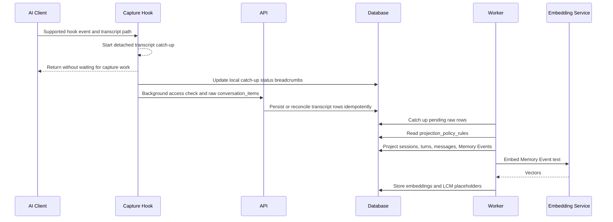
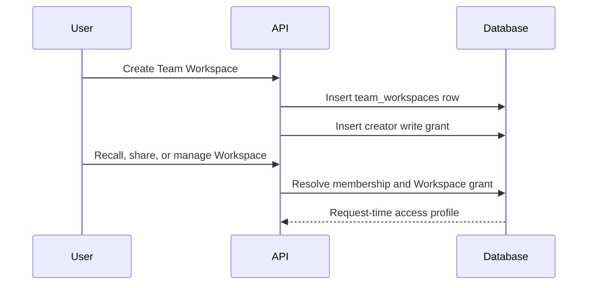
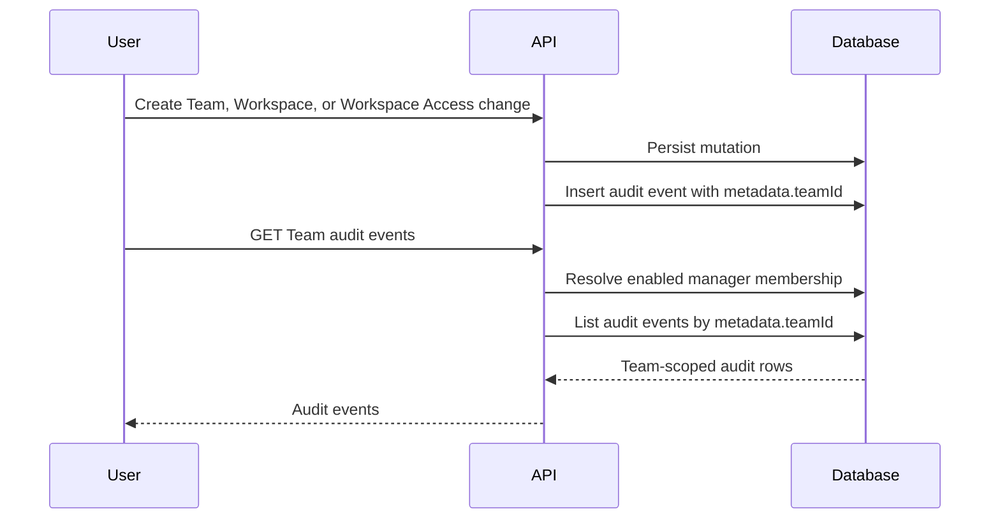
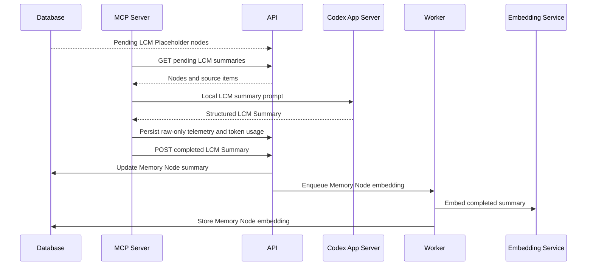
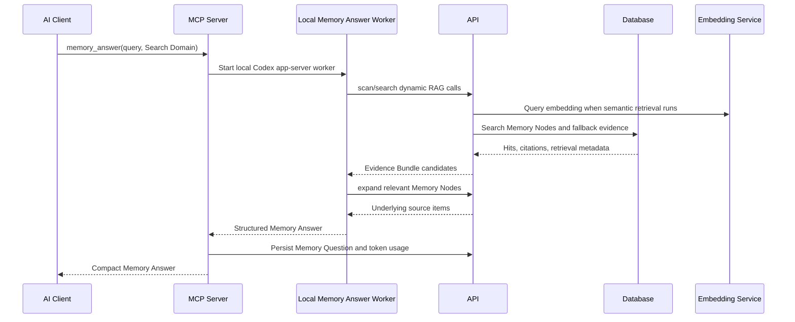

# Service Sequence Overview

This overview describes the high-level service flow for Koed ingestion,
LCM summarisation, and retrieval. It follows the current self-hosted boundary:
the backend stores, projects, embeds, and retrieves memory, while the connected
AI Client performs Answer Synthesis and creates LCM Summaries through local
MCP-side workers.

## Services In Scope

- **AI Client**: Codex is the supported AI Client in this build.
- **Capture Hook**: the TypeScript hook that sends conversation activity to Koed.
- **MCP Server**: the local process that exposes `memory_answer`, runs local
  memory-answer work, and runs the LCM Summary Service.
- **API**: the Fastify backend that authenticates API Tokens, persists raw
  records, runs Projection, and serves recall endpoints.
- **Worker**: the background process that consumes BullMQ or Postgres-backed
  local queue jobs, performs catch-up Projection, embedding work, and LCM node
  embedding.
- **Embedding Service**: Operator-managed service in external dependency mode, or native Koed-owned runtime in bundled-local mode, that turns memory text into retrieval vectors.
- **Database**: Postgres storage for raw conversation items, projected semantic
  rows, Memory Events, Memory Nodes, embeddings, questions, token usage,
  Team Workspace access records, and Team audit events.
- **Koed Server Control Plane**: the local `koed-server` supervisor surface
  that owns `KOED_HOME`, starts Koed app processes, connects to configured
  dependency endpoints, and reports setup/readiness status for headless and
  desktop use.

## Local Service Startup

1. The Operator or Koed Desktop starts `koed-server`.
2. `koed-server` resolves `KOED_HOME`, prepares local config/log/runtime
   directories, provisions the Explorer credential inside `KOED_HOME`, and
   resolves runtime/dependency mode from explicit environment overrides,
   `KOED_HOME/config/server.json`, or package/profile defaults. Packaged Koed
   Desktop starts its managed local personal `koed-server` with
   `runtimeMode=local-personal` and `dependencyMode=bundled-local` unless the
   Operator overrides those values. Desktop bundled-local startup allocates free
   local API, Explorer, Postgres, and Embedding Service ports and persists them
   under `KOED_HOME/config/local-ports.json` for stable later launches.
3. In the current source-checkout path, bare `koed-server` defaults to external
   dependency mode instead of inferring bundled-local from an empty config. The
   Operator starts Postgres/pgvector, Redis/BullMQ, and the Embedding Service
   separately, for example with Docker Compose, and provides explicit
   `DATABASE_URL`, `REDIS_URL`, and `EMBEDDING_SERVICE_URL` values.
   `koed-server` does not start, stop, or inspect Docker Compose in external
   mode.
4. When configured with `dependencyMode: "bundled-local"`, `koed-server start`
   starts native Postgres/pgvector and native Embedding Service runtimes under
   `KOED_HOME`. It does not start Docker Compose. Missing native Postgres,
   Python/llama-server, or model assets report setup guidance. It defaults job
   processing to the Postgres-backed local queue. On macOS, Linux, and WSL,
   `koed-server runtime status --provider homebrew --json` can inspect
   Homebrew-backed runtime assets without installing packages, and
   `koed-server runtime install --provider homebrew --dependency-mode bundled-local --json`
   explicitly installs missing Homebrew packages and links selected binaries
   under `KOED_HOME/runtime`. Model assets are installed out of band with
   `koed-server models install`, which requires configured artifact URLs and
   SHA-256 checksums before writing to `KOED_HOME/models`.
5. `pnpm smoke:bundled-local -- --full --install-runtime --json` verifies this
   native path with an isolated temporary `KOED_HOME`, optional Homebrew-backed
   runtime install for that temporary home, temporary host ports, native resource
   preflight, API Token creation, Capture Hook-like personal ingestion,
   Projection, queue/embedding work, Memory Answer evidence retrieval, Explorer
   reachability, and stop-based cleanup before Operators rely on it for local
   development or packaging checks.
6. The API, Worker, and Explorer run as local app processes supervised by
   `koed-server` and connect to those configured dependency URLs. API/Worker
   job queues use `WORK_QUEUE_BACKEND=bullmq` for Redis/BullMQ or
   `WORK_QUEUE_BACKEND=local` for the Postgres-backed `local_work_queue`
   table.
7. `koed-server stop --json` stops supervised processes in dependency-safe order: Explorer, Worker, API, native Embedding Service, then native Postgres through `pg_ctl stop`. It treats stale process IDs as an idempotent no-op and does not stop Docker Compose or Operator-managed dependencies. `koed-server restart --json` runs the same stop lifecycle, starts a detached `koed-server start` supervisor, and returns machine-readable JSON without streaming startup logs.
8. `koed-server status --json` and `koed-server doctor --json` poll the API
   readiness endpoint, dependency readiness as reported by the API, local
   Worker process state, local API Token configuration, MCP Server doctor
   output, Supported Capture Hook config, Codex config, LCM Summary Service
   availability, and last verification metadata. Status compares the active
   local API URL/token against the Koed-managed Codex MCP block and Capture
   Hook config so stale ports or credentials show as explicit integration
   mismatches. Readiness gates include Postgres reachability and version,
   current migrations, pgvector, local or BullMQ queue backend availability,
   and Embedding Service model/dimension compatibility.
9. `koed-server setup codex --json` wraps the existing guided bootstrap path so
   Codex MCP Server, Supported Capture Hook, local API Token, app-provisioned
   Explorer credential, verification, and doctor setup can be invoked through
   the control plane. Setup applies persisted auto-allocated local ports before
   resolving the API/Explorer URLs, so Desktop-managed ports and direct CLI
   setup write the same target URL/token. `koed-server repair codex --json` is
   the narrower Desktop repair path: it rewrites the Koed-managed Codex MCP
   block and hook config for the currently active local API URL/token without
   running the full bootstrap.
10. Koed Desktop can start/connect to the same headless command surface, run
    the first-launch Codex bootstrap and health-check sequence, poll status,
    offer one-click Codex integration repair for stale local config, and embed
    Explorer without requiring the Operator to invoke repo-local scripts
    directly. Desktop readiness waits for API, Worker/queues, Explorer, and
    the provisioned Explorer credential so static Explorer reachability cannot
    mask an unhealthy processing path. Desktop manages only its local personal
    `koed-server`; remote, Team Self-Hosted, and cloud targets are
    connect-only.

## Capability Discovery

The API exposes `GET /v1/capabilities` as the stable discovery boundary for
clients that can target more than one Koed backend. The endpoint is
unauthenticated and intentionally coarse for this self-hosted distribution: it
does not inspect Memory, emit diagnostics, disclose local paths, or expose
deployment secrets.

Clients should use the capability contract before enabling backend-specific
surfaces. The self-hosted response is a positive, module-registered capability
map: it advertises available local capabilities such as Personal Memory capture,
MCP recall, graph inspection, and local LCM summaries. Clients should treat a
missing capability as unavailable for the current backend. Cloud-only or private
SaaS services register their own capabilities in the cloud backend instead of
being enumerated as unsupported by this public self-hosted build.

## Ingestion

1. Codex emits supported hook events such as `SessionStart`,
   `UserPromptSubmit`, `PostToolUse`, `Stop`, `SubagentStart`, and
   `SubagentStop`.
2. The TypeScript Capture Hook treats the hook event as a trigger signal. It
   starts a detached transcript catch-up process for the transcript path and
   returns without waiting for API writes, Projection, embeddings, or LCM work.
3. The detached catch-up process holds a per-transcript lock so multiple hooks
   coalesce into one active ingestion pass. It drains transcript rows from the
   last checkpoint up to the latest complete JSONL line. If live capture sees
   an existing transcript with no checkpoint, it baselines to the current end of
   file after ingesting only timestamped rows in the first-contact grace window;
   older transcript history requires an explicit historical import. Rows without
   source timestamps are held at the checkpoint until a later timestamped row
   lets Koed interpolate their source time without reordering transcript
   chronology.
4. Catch-up converts Codex transcript records into canonical raw
   `conversation_items` observations with source adapter metadata, idempotency
   keys, source hashes, and `projectionStatus=pending`. `Stop` and
   `SubagentStop` hook signals may also be stored as stripped control records so
   Projection can seal an agent turn, but content-bearing hook fields are
   omitted before storage. Transcript JSONL records are the source of truth for
   display and semantic content.
5. The API authenticates the API Token and persists the raw items as
   `personal` memory through `POST /v1/memory/conversation-items`.
6. During persistence, the API assigns canonical identity only to transcript
   observations. Hook control records do not become canonical messages, tool
   events, Memory Events, LCM sources, or embeddings.
7. Projection reads `projection_policy_rules` to decide which Codex transcript
   item types become UI rows, tool events, Memory Events, embeddings, and LCM
   sources. The seeded policy projects user, agent, subagent, tool call/result,
   and reasoning summary items; context, telemetry, raw reasoning, lifecycle,
   and unknown items remain raw provenance only.
8. Projection derives Koed semantic rows: Captured Sessions, turns, messages,
   tool events, Memory Events, source links, and token usage where available.
   Agent work is bundled into semantic `agent_turn` Memory Events only when a
   seal condition is reached.
9. The API schedules processing for newly projected Memory Events through the
   configured work queue backend. The Worker also runs a catch-up loop over
   pending or failed raw rows.
10. The Worker consumes queued jobs from Redis/BullMQ or `local_work_queue`,
    embeds Memory Events by calling the Embedding Service, and then upserts
    source embeddings.
11. The Worker schedules compaction, creating or updating LCM Placeholder Memory
    Nodes from Memory Events and child nodes, then queues Memory Node embedding.
12. Pending LCM placeholders remain available as degraded evidence until local
    LCM summaries are submitted.

## Team Workspace Access Foundation

The Team SaaS storage foundation keeps Memory ownership separate from
Team Workspace visibility. Team membership identifies whether a User can manage
team-level settings, while a Team Workspace access grant controls whether that
User can recall from, share into, or manage a specific Team Workspace.

1. A User with enabled owner/admin membership creates a Team Workspace.
2. The API stores the `team_workspaces` row and a creator self-grant with
   `write` access in one transaction.
3. Workspace access checks resolve enabled membership and the Workspace grant at
   request time. A missing grant is treated as `disabled`.
4. Recall and share decisions use the resolved Workspace grant: `read` can
   recall, `write` can recall and create shares, and `disabled` can do neither.
5. Workspace grant management requires both enabled owner/admin membership and a
   `write` grant on that Team Workspace, so Workspace-level downgrades take
   effect without rotating credentials.

## Team Audit Log

Team audit events record Team and Workspace control-plane changes without
copying or re-owning Memory. The audit surface is manager-only and scoped by
Team id stored in audit metadata, so Team managers can inspect Team changes
without gaining direct access to unrelated personal records.

1. Team creation writes an audit event with `metadata.teamId` set to the new
   Team id.
2. Team Workspace creation writes an audit event after the Workspace row and
   creator access grant are persisted.
3. Workspace Access create, update, and removal flows write audit events after
   the access mutation is stored.
4. A User requests `GET /v1/teams/:teamId/audit-events`.
5. The API authenticates the User session, resolves Team Membership, and allows
   the listing only for enabled Team managers.
6. The repository lists audit rows whose `metadata.teamId` matches the
   requested Team id, optionally filtered by action and limit.
7. The API returns audit records without exposing sensitive invite or password
   fields in metadata.

## LCM Summarisation

1. Projection and compaction create LCM Placeholder Memory Nodes from
   token-bounded Memory Event spans or lower-level Memory Nodes.
2. The MCP Server starts the local LCM Summary Service on a timer and can also
   nudge it after capture.
3. The LCM Summary Service asks the API for pending session titles and pending
   LCM summaries.
4. The API returns LCM nodes plus ordered source items and marks the work as
   local-only; the backend does not call an LLM for LCM summaries.
5. The local LCM worker builds token-bounded prompts from exact source items or
   child summaries.
6. The LCM worker runs Codex app-server mode locally under the user's Codex
   subscription and parses the returned structured LCM Summary.
7. App-server workflow telemetry is persisted as raw-only conversation items,
   and provider token usage is recorded for attribution.
8. The LCM worker submits the completed LCM Summary to
   `POST /v1/memory/lcm/summaries/{nodeId}`.
9. The API updates the Memory Node summary fields and enqueues Memory Node
   embedding.
10. The Worker embeds the updated Memory Node so retrieval can use the
    completed summary.

## Team Sharing

Team-shared Memory remains user-owned. Sharing is represented by a Share Grant
from a user-owned memory source to one Team and one Workspace. The first
implemented source type is a Captured Session. A Workspace is the stable shared
ID for memories; Project context such as local repo, filepath, ref, branch, or
cwd is used only to resolve or display a Workspace.

1. The User selects a user-owned memory source, Team, Workspace, and expansion
   level. In the first implementation the source is a Captured Session.
2. The API authenticates the API Token as the owning User.
3. The API verifies Team Membership and Workspace Access for the User.
4. The API creates or revokes the Share Grant and writes an audit event.
5. Recall uses active Share Grants at request time, plus independent lifecycle
   gates for Access Suspension, Workspace archive state, membership state,
   and Workspace Access.
6. Personal deletion removes memory from the owner's Personal Memory recall
   surface through `personal_deleted_at` lifecycle markers. It is not the same
   as global invalidation and does not revoke an active Team / Workspace Share
   Grant in the first version.
7. If a local Project context is supplied during recall, the API resolves it to
   a Workspace before Team-shared retrieval. Local Project metadata is not a
   durable authorization key.
8. Archived search is an explicit mode, not the default active recall path. It
   may include retained Workspaces only when the caller and retention policy
   allow it. Access-suspended Team data belongs to a separate admin, legal, or
   Operator mode, not ordinary archived search.
9. A retained Team session Share Grant keeps references to the owning User and
   Captured Session nullable rather than cascading. User account deletion is
   represented by a User tombstone, and retained Team knowledge remains tied to
   the Team and Workspace retention record for audit, restore, and future
   authorized Team recall.
10. Team-visible derived memory is built only from source items inside the
    authorized Team and Workspace boundary. Private personal summaries, graph
    edges, embeddings, or rollups cannot become Team-visible by label change
    when they include unrelated private source material.

## Cross-Identity Sync And Offload

Cross-Identity Sync covers cases where the same logical memory lifespan must be
available across identities or deployments, such as a personal Koed identity
and a Team-side personal identity. It is not a fork or import. A policy-aware
synced replica may exist for availability, indexing, and Team recall, but the
product treats it as the same logical memory lifespan until an explicit
Fork/Import operation is introduced.

1. The source identity authorizes sync of a memory source to a target identity
   or deployment.
2. The target side stores enough synced source material, provenance, and sync
   state to support recall even when the source device is temporarily offline.
3. Team sharing from the target identity still requires a Share Grant and the
   caller's current Team Membership and Workspace Access.
4. Sync revocation stops future propagation. Data already made Team-visible is
   then governed by the target Team, Workspace, Share Grant, and retention
   policy.
5. Fork/Import remains a separate future operation for intentionally creating a
   new, independently evolving memory lifespan.
6. Offload moves storage or processing to a hosted Koed service; it does not by
   itself grant Team visibility or create a fork.

## Future Memory Inbox

Memory Inbox is a future ingestion surface for external Content Objects such as
files, URLs, repository references, meeting notes, or other uploaded material.
It is not part of the first Team memory core, but Team architecture reserves
room for it so external knowledge can use the same flat ownership and
grant-based visibility model.

1. A Content Object is identified and checked against Content Inventory before
   ingestion so duplicate uploads can reuse the existing object where policy
   allows.
2. Ingestion jobs transform approved Content Objects into memory with
   provenance, processing state, and quota/entitlement metadata.
3. Related Content Objects may be grouped into a Knowledge Collection.
4. A Knowledge Collection can be granted to multiple authorized groups without
   re-ingesting the same underlying Content Objects.
5. Recall treats Memory Inbox outputs like any other source class: candidates
   must pass authorization, lifecycle, and provenance checks before ranking,
   expansion, summarization, graph traversal, or export.

## Retrieval

1. The AI Client calls the MCP Server's `memory_answer` tool with a query,
   Retrieval Scope, and Search Domain.
2. The MCP Server starts a local memory-answer worker in Codex app-server mode.
   The worker is given only Koed dynamic RAG tools: `scan`, `search`, and
   `expand`.
3. The local memory-answer worker calls API search through the MCP client's
   dynamic tools. Project search defaults to the current project path, and that
   Project context may resolve to a Workspace for Team-shared search; session
   search requires a captured-session id; global search still only searches
   memory visible through the selected Retrieval Scope.
4. The API authenticates the API Token and calls the core recall path.
5. The repository validates the Search Domain, applies Personal Memory and
   active Team / Workspace Share Grant authorization during candidate selection,
   applies lifecycle gates such as Access Suspension and Workspace archive state,
   and runs retrieval stages over Memory Nodes, fresh pending Memory Events,
   raw fallback evidence, and lexical matches. Semantic stages use local
   embedding search and may be reranked when configured.
   Team Workspace recall uses an explicit Team Workspace id separate from local
   Project matching. The repository resolves the caller's enabled Team
   Membership and Workspace Access before query execution, then admits only the
   caller's Personal Memory plus rows whose sessions have active Share Grants to
   that Team Workspace. Derived Memory Nodes are admitted only when their linked
   source rows are all inside the authorized personal or Team Workspace
   boundary, so unauthorized rows never reach semantic ranking, lexical
   selection, expansion, or reranking inputs.
6. The API returns hits, citations, and retrieval metadata. When a promising
   Memory Node needs more detail, the local memory-answer worker can call
   `expand` to fetch underlying source items.
7. The local memory-answer worker performs Answer Synthesis from the retrieved
   Evidence Bundle and returns structured answer JSON.
8. The MCP Server compacts the response according to `response_detail`.
9. The MCP Server persists the Memory Question result and records token usage
   for the local app-server answer work.
10. The AI Client receives the final Memory Answer and can cite returned
    evidence when requested.

### Recall Stage Ordering

Default recall uses a coarse-to-fine stage order:

1. **Rollup search** looks for broad LCM Rollup matches first.
2. **Scoped leaf search** searches LCM Leaves beneath selected rollups for
   more detailed evidence.
3. **Leaf search** also searches LCM Leaves independently, so detailed evidence
   can surface even when its parent rollup was not selected.
4. **Fresh pending search** searches recent Memory Events that have not yet
   been compacted into LCM Leaves.
5. **Raw fallback search** searches raw embedded evidence and is admitted only
   when higher-priority stages have not filled the requested evidence limit,
   unless the caller explicitly requests raw fallback.

Lexical search is available for exact phrases, identifiers, filenames, error
text, named topics, or recovery after semantic stages fail. It is not the normal
first path for Memory Answer recall.

Stage scores are directional relevance signals. Final evidence selection favors
stage priority first, then weighted score, recency, and stable source ordering.
Pending LCM Summary work may be returned as degraded evidence; the AI Client
should surface that status and rely cautiously on exact source text rather than
treating the pending summary as complete.

## Implementation Anchors

- Capture Hook: `packages/mcp-server/src/capture-hook.ts`
- Raw ingestion API: `apps/api/src/memory/raw-conversation-routes.ts`
- Raw projection catch-up: `apps/worker/src/raw-projection-service.ts`
- Embedding workflow: `apps/worker/src/embedding-workflow.ts`
- LCM Summary Service: `packages/mcp-server/src/lcm-summary-service.ts`
- LCM summary worker: `packages/mcp-server/src/lcm-summary-worker.ts`
- LCM API routes: `apps/api/src/memory/lcm-routes.ts`
- Koed Server control plane: `packages/koed-server/src/cli.ts`
- MCP `memory_answer`: `packages/mcp-server/src/cli.ts`
- Memory answer worker: `packages/mcp-server/src/answer-worker.ts`
- Recall API routes: `apps/api/src/memory/recall-routes.ts`
- Core recall contract: `packages/core/src/index.ts`
- Repository retrieval stages: `packages/db/src/repository.ts`
- Team routes: `apps/api/src/team/routes.ts`
- Team audit repository: `packages/db/src/audit-repository.ts`
