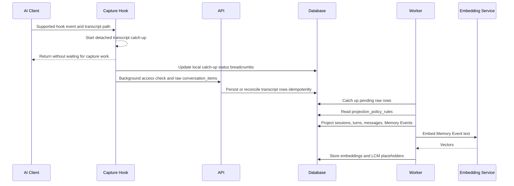
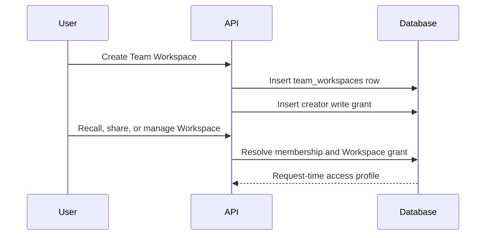
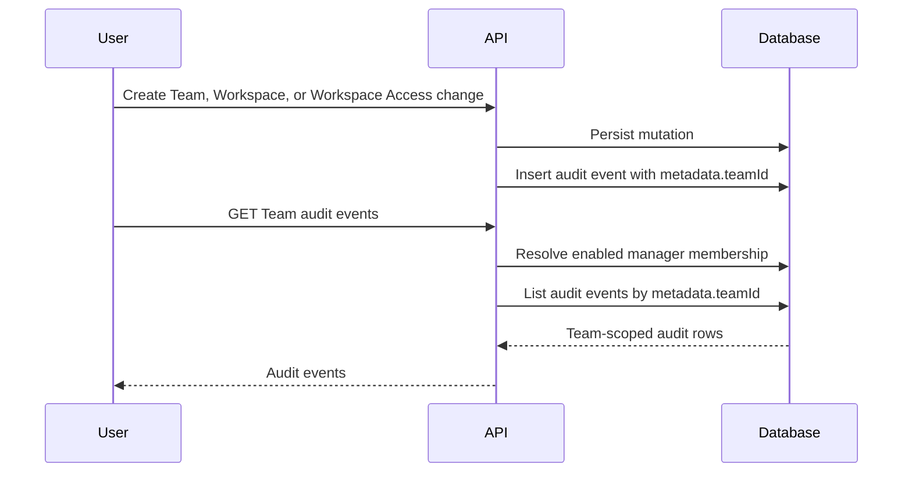
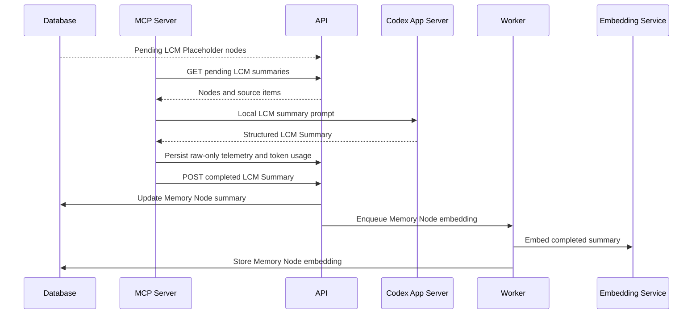
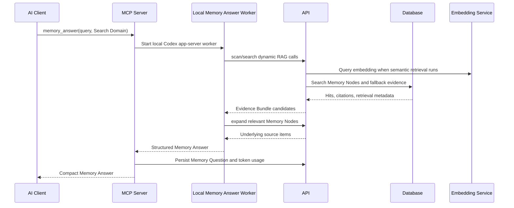

# Service Sequence Overview

This overview describes the high-level service flow for Koed ingestion,
LCM summarisation, and retrieval. It follows the current self-hosted boundary:
the backend stores, projects, embeds, and retrieves memory, while the connected
AI Client performs Answer Synthesis and creates LCM Summaries through local
MCP-side workers.

## Services In Scope

- **AI Client**: Codex is the supported AI Client in this build.
- **Capture Hook**: the TypeScript hook that sends conversation activity to Koed.
- **MCP Server**: the local process that exposes `memory_answer`, runs local
  memory-answer work, and runs the LCM Summary Service.
- **API**: the Fastify backend that authenticates API Tokens, persists raw
  records, runs Projection, and serves recall endpoints.
- **Worker**: the background process that consumes BullMQ or Postgres-backed
  local queue jobs, performs catch-up Projection, embedding work, and LCM node
  embedding.
- **Embedding Service**: Operator-managed service in external dependency mode, or native Koed-owned runtime in bundled-local mode, that turns memory text into retrieval vectors.
- **Database**: Postgres storage for raw conversation items, projected semantic
  rows, Memory Events, Memory Nodes, embeddings, questions, token usage,
  Team Workspace access records, Team audit events, and commercial encrypted
  field envelopes for human-readable Memory and evidence fields.
- **Koed Server Control Plane**: the local `koed-server` supervisor surface
  that owns `KOED_HOME`, starts Koed app processes, connects to configured
  dependency endpoints, and reports setup/readiness status for headless and
  desktop use on macOS, Linux, and WSL. Native Windows packaged app support is
  not part of this build.

## Local Service Startup

1. The Operator or Koed Desktop starts `koed-server`.
2. `koed-server` resolves `KOED_HOME`, prepares local config/log/runtime
   directories, provisions the Explorer credential inside `KOED_HOME`, and
   resolves runtime/dependency mode from explicit environment overrides,
   `KOED_HOME/config/server.json`, or package/profile defaults. Packaged Koed
   Desktop starts its managed local personal `koed-server` with
   `runtimeMode=local-personal` and `dependencyMode=bundled-local` unless the
   Operator overrides those values. Desktop bundled-local startup allocates free
   local API, Explorer, Postgres, and Embedding Service ports and persists them
   under `KOED_HOME/config/local-ports.json` for stable later launches. The same
   control plane uses `KOED_HOME/config`, `run`, `logs`, `data`, `models`,
   `cache`, and `runtime` as durable local state.
3. In the current source-checkout path, bare `koed-server` defaults to external
   dependency mode instead of inferring bundled-local from an empty config. The
   Operator starts Postgres/pgvector, Redis/BullMQ, and the Embedding Service
   separately, for example with Docker Compose, and provides explicit
   `DATABASE_URL`, `REDIS_URL`, and `EMBEDDING_SERVICE_URL` values.
   `koed-server` does not start, stop, or inspect Docker Compose in external
   mode.
4. When configured with `dependencyMode: "bundled-local"`, `koed-server start`
   starts native Postgres/pgvector and native Embedding Service runtimes under
   `KOED_HOME`. It does not start Docker Compose. Missing native Postgres,
   Embedding Service entry, llama-server, or model assets report setup guidance through
   `koed-server runtime status/install` and `koed-server models status/install`,
   not repo scripts. It defaults job processing to the Postgres-backed local
   queue. Packaged Desktop can ship platform/architecture native resources plus
   `runtime-asset-manifest.json`; `koed-server runtime install --provider packaged --dependency-mode bundled-local --json`
   verifies SHA-256, executable bits, PostgreSQL 17, `llama-server`, and loader
   dependencies before copying resources into `KOED_HOME/runtime`. For local
   packaged-native smoke, `pnpm native-runtime:stage:homebrew` can create a
   `KOED_NATIVE_RUNTIME_SOURCE_DIR` staging directory from local Homebrew/Linuxbrew
   formulas; this is a development helper rather than a release-quality runtime
   distribution. Python virtualenv files are no longer packaged native runtime
   assets. Packaged Koed
   Desktop also calls `koed-server models status --kind embedding --json` and
   `koed-server models install --kind embedding --json` during first-run local
   personal setup when the embedding model is missing or checksums do not match.
   On macOS, Linux, and WSL, `koed-server runtime status --provider homebrew --json` can
   inspect Homebrew-backed runtime assets without installing packages, and
   `koed-server runtime install --provider homebrew --dependency-mode bundled-local --json`
   explicitly installs missing Homebrew packages and links selected binaries
   under `KOED_HOME/runtime`. Linux packaged native assets target glibc 2.35+
   distributions such as Ubuntu 22.04/Debian 12 or newer; unsupported hosts fail
   with explicit guidance instead of Docker Compose or source-checkout fallback.
   Native Windows packaged app support is not shipped in this build; use WSL for
   local development. Model assets are installed out of band with
   `koed-server models install`, which requires configured artifact URLs and
   SHA-256 checksums before writing to `KOED_HOME/models`. See
   `docs/native-runtime-assets.md`.
5. `pnpm smoke:bundled-local -- --full --install-runtime --json` verifies this
   native path with an isolated temporary `KOED_HOME`, optional Homebrew-backed
   runtime install for that temporary home, temporary host ports, native resource
   preflight, API Token creation, Capture Hook-like personal ingestion,
   Projection, queue/embedding work, Memory Answer evidence retrieval, Explorer
   reachability, and stop-based cleanup before Operators rely on it for local
   development or packaging checks.
6. The API, Worker, and Explorer run as local app processes supervised by
   `koed-server` and connect to those configured dependency URLs. API/Worker
   job queues use `WORK_QUEUE_BACKEND=bullmq` for Redis/BullMQ or
   `WORK_QUEUE_BACKEND=local` for the Postgres-backed `local_work_queue`
   table.
7. `koed-server start --daemon --json` starts a detached `koed-server start` supervisor and returns machine-readable startup intent for Desktop and scripts. `koed-server stop --json` stops supervised processes in dependency-safe order: Explorer, Worker, API, native Embedding Service, then native Postgres through `pg_ctl stop`. It treats stale process IDs as an idempotent no-op and does not stop Docker Compose or Operator-managed dependencies. `koed-server restart --json` runs the same stop lifecycle, starts a detached `koed-server start` supervisor, and returns machine-readable JSON without streaming startup logs.
8. `koed-server status --json` and `koed-server doctor --json` poll the API
   readiness endpoint, dependency readiness as reported by the API, local
   Worker process state, local API Token configuration, MCP Server doctor
   output, Supported Capture Hook config, Codex config, LCM Summary Service
   availability, and last verification metadata. Status compares the active
   local API URL/token against the Koed-managed Codex MCP block and Capture
   Hook config so stale ports or credentials show as explicit integration
   mismatches. Readiness gates include Postgres reachability and version,
   current migrations, pgvector, local or BullMQ queue backend availability,
   and Embedding Service model/dimension compatibility.
9. `koed-server setup codex --json` wraps the existing guided bootstrap path so
   Codex MCP Server, Supported Capture Hook, local API Token, app-provisioned
   Explorer credential, verification, and doctor setup can be invoked through
   the control plane. Setup applies persisted auto-allocated local ports before
   resolving the API/Explorer URLs, so Desktop-managed ports and direct CLI
   setup write the same target URL/token. `koed-server repair codex --json` is
   the narrower Desktop repair path: it rewrites the Koed-managed Codex MCP
   block and hook config for the currently active local API URL/token without
   running the full bootstrap.
10. Koed Desktop can start/connect to the same headless command surface, run
    the first-launch Codex bootstrap and health-check sequence, poll status,
    offer one-click Codex integration repair for stale local config, provision
    the embedding model through `koed-server models status/install --json` in
    bundled-local mode, and embed Explorer without requiring the Operator to
    invoke repo-local scripts directly. Desktop readiness waits for API,
    Worker/queues, Explorer, and the provisioned Explorer credential so static
    Explorer reachability cannot mask an unhealthy processing path. Desktop
    manages only its local personal `koed-server`; remote, Team Self-Hosted,
    and cloud targets are connect-only.

## Server Deployment Boundary

Server, private VPS, Team Self-Hosted, and Koed-managed cloud deployments are
described as `koed-server` plus dependencies. API, Worker, Explorer, queue
processors, and diagnostics are implementation surfaces inside that server
boundary. Postgres/pgvector, the selected queue backend, the Embedding Service,
reverse proxy/TLS, and backup/restore jobs are dependencies of the deployment.
This remote/server boundary is not the normal MCP or Capture Hook target when a
User has a local Koed install: Codex MCP Server and Supported Capture Hook
configuration should point at the local `koed-server`, and that local edge
server routes explicitly approved Team Workspace, Share Grant, sync/offload, or
remote capture-bearing operations to the registered upstream.

Local Desktop native setup is distinct: Desktop starts and monitors its managed
local personal `koed-server`, and bundled-local mode may run native Postgres and
Embedding Service resources under `KOED_HOME` without Docker. Source-checkout
Docker Compose remains a dependency starter and example, not the long-term
product boundary. See
[server-deployment-boundary.md](server-deployment-boundary.md) for migration
notes and Linear planning references.

## Capability Discovery

The API exposes `GET /v1/capabilities` as the stable discovery boundary for
clients that can target more than one Koed backend. The endpoint is
unauthenticated and intentionally coarse for this self-hosted distribution: it
does not inspect Memory, emit diagnostics, disclose local paths, or expose
deployment secrets.

Clients should use the capability contract before enabling backend-specific
surfaces. Capability schema version 3 reports the deployment profile, runtime
shape, authentication providers, memory surfaces, commercial gates, entitlement
status shape, and security posture for the current `koed-server` instance.
Supported deployment profiles
are `developer`, `local_personal`, `private_vps`, `team_self_hosted`, and
`koed_managed_cloud`. The profile tells clients which positive surfaces are
available, partial, or unavailable; clients must not infer behavior from
hostnames, ports, package names, or route probing. The public capability
contract is safe for unauthenticated discovery and must not disclose local
paths, secrets, tenant internals, provider configuration, diagnostics, or
Memory content.

Authenticated clients may call `GET /v1/capabilities/authenticated` for the
same versioned contract under session authentication. That authenticated
surface is the extension point for future identity-bound capabilities, device
enrollment, upstream routing, entitlements, and support/admin scopes. WorkOS or
other browser identity providers identify the User, but Koed remains the source
of truth for Memory authorization, Share Grants, Team Workspace access, Access
Suspension, and commercial entitlements.

Authenticated clients may include `teamId` when they need Team-scoped
entitlement and billing state. The response reports only coarse gate data:
entitlement status, whether Team access is allowed, denied operation families,
billing status, over-limit state, and the billing-seat sync state. It also
publishes `commercial.featureGates`, which maps concrete client features such
as Team Workspaces, Share Grants, Memory Inbox, Cross-Identity Sync, hosted
operations, support/admin, and Team limits to capability keys, availability,
entitlement state, billing state, and server-side enforcement status. The stable
entitlement/billing state vocabulary lets Desktop render inactive, trial,
expired, canceled, over-limit, unsupported, and unavailable states without
probing routes. It must not include billing-provider ids, invoices, subscription
internals, raw Memory, provider credentials, or operator-entered private billing
notes. If the User cannot view that Team entitlement gate, the request fails
closed.

WorkOS/AuthKit is advertised only when the backend deployment profile supports
it and the Operator has explicitly enabled AuthKit configuration. `GET
/auth/workos/login` creates a short-lived state cookie and redirects the
browser to AuthKit. `GET /auth/workos/callback` validates that state, exchanges
the returned code with WorkOS, maps the provider user id to a Koed User, and
creates a Koed browser session. Provider access tokens, refresh tokens, API
keys, and OAuth credentials are not stored in Koed identity snapshots. Email is
an identity attribute, not the linking key: an external identity that matches an
existing Koed email but has no provider mapping must fail closed instead of
silently attaching to that account.

The public capability contract includes `auth.enrollment.setupPath` so Desktop
can choose a setup screen without probing routes. Local personal backends report
`local_simple_api_token` for local-only Personal Memory setup, while still
advertising device enrollment as available for registered remote/private/cloud
upstream pairing. Remote/private/cloud backends report
`remote_device_enrollment` when browser-mediated device enrollment is available.
The same block repeats the device-enrollment availability, the personal-only API
Token fallback scope, and the invariant that MCP Server and Supported Capture
Hook configuration should normally target local `koed-server`.

## Route Identity Contract

API routes declare their identity boundary in
`apps/api/src/server/route-identity.ts`, and the same contract is exported
through `GET /openapi.json`. The contract is the source of truth for clients,
tests, and future route review. It distinguishes:

- `public`: unauthenticated discovery or health surfaces.
- `optional_session`: redacted public behavior with additional details for a
  browser-authenticated User.
- `session`: browser/User operations, including Team management, Team
  Workspace management, API Token management, authenticated diagnostics, and
  authenticated capability discovery.
- `api_token`: AI-client compatibility operations for personal Memory capture,
  personal recall, local work queues, and diagnostic smoke tests.
- `session_or_api_token`: personal/local surfaces that are safe through either
  browser session or API Token.
- `session_or_device_credential`: Team-scoped remote-control surfaces that
  accept either a browser session or a scoped enrolled device credential.
  Browser session is the preferred identity for interactive Team recall and
  graph. Team admin and Share Grant management remain session-only unless a
  later design explicitly promotes a device-mediated management path.
- `conditional_team_session_or_device`: personal recall/graph routes that
  accept an API Token only for personal scope and require a browser session or
  scoped enrolled device credential when a Team Workspace scope is requested.
- `device_credential`: enrolled local-edge status and remote-operation
  credential checks. Device credentials identify a User, upstream backend, and
  local device; they do not carry Team authority.
- `upstream_credential` and `internal_service_token`: explicit future
  boundaries that must remain `not_implemented` until the corresponding relay
  or internal-service design exists.

API Tokens remain personal-memory credentials for AI Client compatibility. They
must not carry Team authority, create Share Grants, manage Workspaces, unlock
Team Workspace recall, or act as a hosted-service credential. Team authority is
resolved at request time from Koed-owned Membership, Team Workspace Access,
Share Grant, lifecycle, profile, and entitlement state. Retrieval and graph
routes must filter authorized candidates before semantic ranking or expansion;
post-filtering is only defense in depth.

The route contract also exports `x-koed-deployment-modes` for each implemented
OpenAPI operation. This metadata describes where an endpoint is product-applicable
across `developer`, `local_personal`, `private_vps`, `team_self_hosted`, and
`koed_managed_cloud`; it is not an authorization grant and does not replace
`/v1/capabilities`. Clients should use capability discovery for runtime
availability, deployment-mode metadata for documentation and generated-client
applicability, and request-time authorization for actual access decisions.
Team, Team Workspace, entitlement, and invite routes are applicable only to
Team-capable deployment profiles. WorkOS/AuthKit and device-enrollment setup
routes are applicable only to remote Team/cloud profiles. Local-edge relay and
device-credential validation routes are applicable to local edge profiles.

## Operations Status

`GET /ready` remains the machine-readable readiness gate for process
supervision and load balancers. It reports whether core dependencies are ready
enough to serve traffic.

`GET /ops/status` is the authenticated redacted operations snapshot for
Operators. It reports API runtime state, Postgres readiness, migration status,
pgvector, Redis when required, work queue counts, Embedding Service/model
compatibility, request latency/error-rate status from
`KOED_OPS_REQUEST_METRICS_STATUS_PATH` when configured, API process resource
pressure, disk pressure for `KOED_HOME`, and backup freshness when
`KOED_BACKUP_STATUS_PATH` is configured. The endpoint produces alert-shaped
items with optional runbook links from `KOED_RUNBOOK_BASE_URL`; it must not
emit raw Memory, prompts, transcripts, request bodies, provider secrets, API
Tokens, database URLs, or backup object credentials. A missing backup or
request-metrics status file is an operations degradation signal, not a readiness
failure. In hosted-capable profiles (`private_vps`, `team_self_hosted`, and
`koed_managed_cloud`), `/ops/status` and `POST /ops/test-alert` additionally
require the browser-session email to be listed in `KOED_OPS_OPERATOR_EMAILS`
for hosted operations routes, including
`GET /ops/support/teams/{teamId}/overview`. `POST /ops/test-alert` is a
browser-session-only synthetic alert payload for validating alert routing and
runbook links without inducing a real outage. When
`KOED_OPS_ALERT_WEBHOOK_URL` is configured, the test-alert route posts the
redacted alert payload to that webhook using the optional
`KOED_OPS_ALERT_WEBHOOK_TOKEN`; status responses disclose only that the webhook
sink and token are configured, never the URL or token value.

Koed-managed cloud support/admin surfaces use the separate
[Hosted Support And Admin Access Policy](hosted-support-admin-policy.md).
Default support views are redacted operational views. The hosted-operator view
is `GET /ops/support/teams/{teamId}/overview`, requires an allowed ops operator
browser session, records `hosted_operator_redacted` audit metadata, and returns
Team-level identifiers, status, counts, setup/integration health aggregates,
and timestamps only. `POST /ops/support/teams/{teamId}/bundle` packages that
redacted hosted support overview through the shared encrypted package envelope,
requires an envelope provider, expires the package, and writes
`team.hosted_support_bundle.created` audit metadata. The customer-visible
Team-manager view remains
`GET /v1/teams/{teamId}/support/overview`; it requires a browser-session Team
owner/admin and records `team_manager_redacted` audit metadata. Both views link
to support-safe related surfaces such as `/ops/status`, authenticated
capabilities, entitlement, billing-seat, and audit-event routes; global
runtime, queue, backup, and readiness state stay in `/ops/status`. Any
raw-content break-glass flow must be separately scoped, approved, expiring,
audited, and customer-visible; support/admin tooling must not use normal recall
routes as an impersonation path.

Hosted backup and restore checks are operator-run workflows. `pnpm
hosted:backup -- create` writes a `pg_dump` custom archive encrypted through
the configured envelope provider (`local_test_key`, `managed_kms`, `byok`, or
`cmek`), a manifest, and a redacted status file. The archive ciphertext lives in
the `.dump.enc` file; the manifest keeps only non-secret envelope metadata. For
encrypted backups, the temporary plaintext dump is removed in failure paths as
well as success paths. `pnpm hosted:backup -- verify` decrypts the archive to a
temporary local file, checks archive readability with `pg_restore --list`, and
deletes the temporary file. `pnpm hosted:backup -- restore-smoke` decrypts the
archive to a temporary local file, restores into an explicit clean disposable
database URL after the Operator repeats the target database name with
`--confirm-restore-smoke-target`, and deletes the temporary file. These commands
feed `/ops/status` through
`KOED_BACKUP_STATUS_PATH`; failed runs write a redacted `status: "error"` status
payload when a status path is configured, so operations alerts do not have to
wait for freshness expiry. Backup commands do not run inside request handling.

Hosted capacity checks are also operator-run workflows. `pnpm hosted:capacity
-- plan` prints the current launch assumptions, and `pnpm hosted:capacity -- run`
exercises public readiness/capability routes, personal capture, personal recall,
Team Workspace answer routes through browser sessions and scoped device
credentials, local-edge Team proxying, graph overview, and `/ops/status`
depending on the selected scenario and available credentials. When
`DATABASE_URL` is available, the harness records before/after database and local
queue snapshots; when a browser session cookie is available, it records redacted
`/ops/status` snapshots. The report includes a launch-gate assessment with
latency and error-rate headroom, failed bottleneck checks, and queue/storage
observations so launch reviewers can attach the result directly to the relevant
validation issue. The harness must not log API Tokens, cookies, device
credentials, database passwords, raw Memory, transcripts, prompts, or provider
secrets.

Hosted activation analytics use `POST /v1/analytics/activation-events`. The
route requires a browser session, accepts only enumerated activation events and
surfaces, checks supplied Team or Workspace IDs against request-time Koed
authorization, and records durable `analytics.activation.*` audit events with
flat scalar metadata only. Metadata uses an explicit low-cardinality allowlist;
string values must be short token-like values rather than free-form text. API
Tokens, device credentials, Capture Hooks, and MCP Server credentials must not
record hosted product analytics. `GET
/v1/analytics/activation-funnel` returns redacted event-count summaries grouped
by event, surface, and deployment profile. Personal summaries are scoped to the
authenticated User's own activation events; Team or Workspace summaries require
an enabled Team owner/admin and never expose event metadata attributes or raw
Memory.

## Local Edge Upstream Registry

Local edge `koed-server` can register upstream backends for later remote,
private VPS, Team Self-Hosted, or Koed-managed cloud routing. The registry lives
under `KOED_HOME/config/upstream-backends.json` and stores only non-secret
metadata: stable upstream id, display name, base URL, deployment profile,
credential existence/status, route-policy metadata, and a sanitized cache of the
upstream public capability contract.

Registering an upstream is not sufficient to route memory traffic. Route policy
defaults are fail-closed for capture-bearing writes, Team Workspace recall,
Share Grant management, sync/offload, and admin operations. `koed-server
upstream refresh --id <id> --json` validates the upstream `/v1/capabilities`
contract and records checked, expiry, schema, profile, release, and failure
metadata. `koed-server upstream policy --id <id> --... enabled --json`
explicitly enables the operation families the Operator has approved. Stale,
failed, and unchecked upstreams show as attention items in `koed-server status
--json` and `doctor --json`, so future routing can refuse remote-dependent
operations without guessing from hostnames, ports, or route availability.

The API local-edge layer resolves remote routing through explicit route
decisions. `POST /v1/local-edge/route-decisions` uses the upstream registry,
cached capability state, route policy, the User's active device credential
metadata, and the effective Capture Policy where capture-bearing writes are
requested. Personal Memory read/capture stays local unless an upstream id is
explicitly supplied. Remote Team Workspace read, sync, or capture-bearing
actions fail closed when the upstream is missing, route policy is disabled,
capabilities are stale/failed/unchecked, the User has no matching device
credential, or the device credential does not allow the requested operation
family. Share Grant management and Team admin stay behind browser-session
authorization in the current API.

`POST /v1/local-edge/upstream-operations` is the live proxy path for operations
that resolve to `live_upstream_proxy`. It accepts a `Koed-Device` credential and
relays only non-local-edge `/v1/*` API paths to the selected upstream, preserving
any configured upstream base-path prefix. The accepted `Koed-Device` credential
authorizes the local-edge operation only. Local edge then resolves separate
upstream relay authorization from secret storage using the selected backend's
safe credential reference or backend id; if that relay credential is missing,
the route fails closed. It does not forward arbitrary browser headers or the
local device credential upstream, does not store reusable upstream credentials
in the upstream registry, and does not expose upstream credentials to MCP Server
or Supported Capture Hook processes. Queued sync/offload currently resolves as
an explicit
`queued_sync_handoff` decision only; the durable Cross-Identity Sync/offload
state model records logical memory identity, source and target replicas, sync
relationships, resumable upload sessions, chunks, and inbox/outbox entries for
the later hosted intake and worker implementation.

## Explorer-First Auth And Device Enrollment

Koed Desktop and Explorer are the primary setup and inspection surface for
local, private VPS, Team Self-Hosted, and Koed-managed cloud targets. The
accepted design is recorded in
[ADR 0008](adr/0008-explorer-first-auth-and-device-enrollment.md).

Local personal setup may keep app-provisioned API Tokens for AI-client
compatibility. Cloud and Team setup must guide the User through browser session
auth and, where supported, browser-mediated device enrollment. Browser sessions,
API Tokens, device credentials, upstream credentials, and WorkOS/AuthKit server
secrets are distinct credential classes. API Tokens stay personal-memory
credentials and do not carry Team authority. Device credentials identify an
enrolled local edge and upstream, but all Team Membership, Workspace Access,
Share Grant, lifecycle, and entitlement decisions remain request-time Koed
authorization checks.

Browser-mediated device enrollment uses local-edge routes, not API Tokens. A
browser-authenticated User creates a short-lived enrollment challenge with
`POST /v1/local-edge/device-enrollments/challenges`, opens Explorer against the
challenge id, and reviews the safe approval context through
`GET /v1/local-edge/device-enrollments/challenges/{challengeId}`. Explorer can
approve or deny the challenge through
`POST /v1/local-edge/device-enrollments/challenges/{challengeId}/approval`;
approval binds a device credential to the User, upstream backend, device
instance, operation families, and server-side verifier material, while denial
consumes the challenge. For shared-secret credentials, the client submits a
fresh device secret over the browser-authenticated enrollment channel and the
server hashes it with server-side secret material before persistence. The older
direct redemption route `POST /v1/local-edge/device-enrollments/credentials`
remains available for headless/browser-mediated exchanges that already have
session auth. Server-side persistence stores only verifier hashes or public-key
material, never reusable device secrets. `GET
/v1/local-edge/device-credentials/status` accepts the `Koed-Device` credential
scheme for credential validation, while listing and revocation remain
browser-session routes. Revoking a device credential stops future
device-credential authentication without rotating local personal API Tokens.

Device credential metadata records created, updated, last-used, last-validated,
expiry, and revocation state. Audit events record credential creation and
revocation without verifier hashes, challenge hashes, public keys, reusable
secrets, or Team authority. Diagnostics may show credential existence, status,
and timestamps only. Detached Capture Hook child processes inherit local
capture configuration but scrub upstream/cloud/device credential environment
variables so MCP Server and Supported Capture Hook execution never receive
remote credential material directly.

## Team Entitlement And Access Suspension Gates

Team entitlement state is a request-time lifecycle gate on Team and Team
Workspace behavior. The current coarse states are `active`, `grace`,
`suspended`, and `revoked`. `active` and `grace` allow normal Team Workspace
recall, sharing, ingestion, sync handoff, and Team admin flows. `suspended` and
`revoked` deny those Team operation families without deleting Users, Teams,
Workspaces, Share Grants, or retained Memory rows.

The gate is enforced alongside existing Team Membership, Workspace Access,
Workspace archive, and Share Grant checks; it does not replace them. Repository
authorization returns coarse gate status for later capability discovery and
billing integration, while public capability responses remain owned by the
capability-discovery work. Entitlement changes emit Team audit events with
previous/current status, reason, and denied operation families only; they must
not include Memory content, API Tokens, provider credentials, or billing
secrets.

Team billing seat state is stored separately from provider-specific billing
integration. Membership enablement, invite acceptance, and member disablement
reconcile billable seat counts transactionally and emit redacted Team audit
events. Generic member-management routes reject self-directed role/status
changes and must not remove the last enabled owner from the Team. Seat overage
records an explicit `over_limit` state and may move the Team into `grace` with
`seat_limit_exceeded`; reducing seats back within the configured limit restores
only that seat-caused grace state. External billing provider synchronization
remains a later integration on top of this durable seat lifecycle state.

## Ingestion

1. Codex emits supported hook events such as `SessionStart`,
   `UserPromptSubmit`, `PostToolUse`, `Stop`, `SubagentStart`, and
   `SubagentStop`.
2. The TypeScript Capture Hook treats the hook event as a trigger signal. It
   starts a detached transcript catch-up process for the transcript path and
   returns without waiting for API writes, Projection, embeddings, or LCM work.
3. The detached catch-up process holds a per-transcript lock so multiple hooks
   coalesce into one active ingestion pass. It drains transcript rows from the
   last checkpoint up to the latest complete JSONL line. If live capture sees
   an existing transcript with no checkpoint, it baselines to the current end of
   file after ingesting only timestamped rows in the first-contact grace window;
   older transcript history requires an explicit historical import. Rows without
   source timestamps are held at the checkpoint until a later timestamped row
   lets Koed interpolate their source time without reordering transcript
   chronology.
4. Catch-up converts Codex transcript records into canonical raw
   `conversation_items` observations with source adapter metadata, idempotency
   keys, source hashes, and `projectionStatus=pending`. `Stop` and
   `SubagentStop` hook signals may also be stored as stripped control records so
   Projection can seal an agent turn, but content-bearing hook fields are
   omitted before storage. Transcript JSONL records are the source of truth for
   display and semantic content.
5. The API authenticates the API Token and persists the raw items as
   `personal` memory through `POST /v1/memory/conversation-items`.
6. During persistence, the API assigns canonical identity only to transcript
   observations. Hook control records do not become canonical messages, tool
   events, Memory Events, LCM sources, or embeddings.
7. Projection reads `projection_policy_rules` to decide which Codex transcript
   item types become UI rows, tool events, Memory Events, embeddings, and LCM
   sources. The seeded policy projects user, agent, subagent, tool call/result,
   and reasoning summary items; context, telemetry, raw reasoning, lifecycle,
   and unknown items remain raw provenance only.
8. Projection derives Koed semantic rows: Captured Sessions, turns, messages,
   tool events, Memory Events, source links, and token usage where available.
   Agent work is bundled into semantic `agent_turn` Memory Events only when a
   seal condition is reached. When a commercial envelope provider is configured,
   raw `conversation_items`, projected message/tool payloads, projected
   Memory Event payloads, Memory Node text/source fields, embedding source
   text, and Memory Question query/answer/evidence/worker payloads receive
   encrypted field companions with owner, visibility, source table, source
   column, provider, and key metadata. In paid Koed-managed cloud, new raw
   conversation-item rows store redacted operational source fields; Projection
   hydrates the raw source companions inside the repository boundary before
   deriving semantic rows. New message, tool-event, Memory Event, Memory Node,
   embedding, and Memory Question rows also store redacted operational payloads,
   and repository read paths hydrate authorized graph, embedding, retrieval,
   LCM source content, and Memory Question payloads from encrypted companions
   after access checks.
9. The API schedules processing for newly projected Memory Events through the
   configured work queue backend. The Worker also runs a catch-up loop over
   pending or failed raw rows.
10. The Worker consumes queued jobs from Redis/BullMQ or `local_work_queue`,
    embeds Memory Events by calling the Embedding Service, and then upserts
    source embeddings.
11. The Worker schedules compaction, creating or updating LCM Placeholder Memory
    Nodes from Memory Events and child nodes, then queues Memory Node embedding.
    In paid Koed-managed cloud, placeholder summaries, body text, source item
    JSON, completed LCM summaries, and structured LCM summary JSON are stored as
    redacted Memory Node fields with encrypted companions.
12. Pending LCM placeholders remain available as degraded evidence until local
    LCM summaries are submitted.

Commercial/private VPS/Team deployments can run encrypted-field backfill over
existing human-readable Memory and evidence columns. Backfill is whitelist-based
per source table/column, skips already-encrypted fields, records resumable
cursors and counts, and fails closed when the configured envelope provider or
key cannot encrypt the next field. The provider boundary supports
`local_test_key` for local/operator-managed use and KMS-backed modes
(`managed_kms`, `byok`, or `cmek`) for paid Koed-managed cloud. Paid cloud must
delegate DEK wrap/unwrap to KMS and may rewrap DEKs to the current key version
without rewriting payload bytes by running `pnpm hosted:encryption-rewrap` in
bounded batches. `operator_kms` is reserved until a real
operator KMS adapter exists. BYOK and CMEK use the same KMS provider path with
customer-controlled key references; if that key access is revoked, suspended,
unreachable, or denied, decrypt-dependent recall, evidence, export, support,
sync, backup, and restore paths fail closed for affected payloads.
Decrypted values must not be written to queue payloads, audit metadata, status
responses, logs, or diagnostics.

## Team Workspace Access Foundation

The Team SaaS storage foundation keeps Memory ownership separate from
Team Workspace visibility. Team membership identifies whether a User can manage
team-level settings, while a Team Workspace access grant controls whether that
User can recall from, share into, or manage a specific Team Workspace.

1. A User with enabled owner/admin membership creates a Team Workspace.
2. The API stores the `team_workspaces` row and a creator self-grant with
   `write` access in one transaction.
3. Workspace access checks resolve enabled membership and the Workspace grant at
   request time. A missing grant is treated as `disabled`.
4. Recall and share decisions use the resolved Workspace grant: `read` can
   recall, `write` can recall and create shares, and `disabled` can do neither.
5. Workspace grant management requires both enabled owner/admin membership and a
   `write` grant on that Team Workspace, so Workspace-level downgrades take
   effect without rotating credentials.

## Team Audit Log

Team audit events record Team and Workspace control-plane changes without
copying or re-owning Memory. The audit surface is manager-only and scoped by
Team id stored in audit metadata, so Team managers can inspect Team changes
without gaining direct access to unrelated personal records.

1. Team creation writes an audit event with `metadata.teamId` set to the new
   Team id.
2. Team Workspace creation writes an audit event after the Workspace row and
   creator access grant are persisted.
3. Workspace Access create, update, and removal flows write audit events after
   the access mutation is stored.
4. A User requests `GET /v1/teams/:teamId/audit-events`.
5. The API authenticates the User session, resolves Team Membership, and allows
   the listing only for enabled Team managers.
6. The repository lists audit rows whose `metadata.teamId` matches the
   requested Team id, optionally filtered by action and limit.
7. The API returns audit records without exposing sensitive invite or password
   fields in metadata.

## LCM Summarisation

1. Projection and compaction create LCM Placeholder Memory Nodes from
   token-bounded Memory Event spans or lower-level Memory Nodes.
2. The MCP Server starts the local LCM Summary Service on a timer and can also
   nudge it after capture.
3. The LCM Summary Service asks the API for pending session titles and pending
   LCM summaries.
4. The API returns LCM nodes plus ordered source items and marks the work as
   local-only; the backend does not call an LLM for LCM summaries. If the node
   is encrypted at rest, the repository hydrates source items and child
   summaries only after the caller has passed the visibility boundary.
5. The local LCM worker builds token-bounded prompts from exact source items or
   child summaries. The prompt requires secret-like literal redaction and, when
   ordered source items or child summaries conflict, prefers later items while
   preserving older conflicts only as superseded context. It also asks the AI
   Client to keep active decisions, stable facts, unresolved questions, and tool
   outcomes in their matching structured fields while compressing repetitive
   logs and lifecycle noise into durable findings.
6. The LCM worker runs Codex app-server mode locally under the user's Codex
   subscription and parses the returned structured LCM Summary.
7. App-server workflow telemetry is persisted as raw-only conversation items,
   and provider token usage is recorded for attribution.
8. The LCM worker submits the completed LCM Summary to
   `POST /v1/memory/lcm/summaries/{nodeId}`.
9. The API updates the Memory Node summary fields and enqueues Memory Node
   embedding. In paid Koed-managed cloud, the stored summary/body/structured
   JSON fields remain redacted and the submitted LCM Summary is written to
   encrypted companions.
10. The Worker embeds the updated Memory Node so retrieval can use the
    completed summary.

## Team Sharing

Team-shared Memory remains user-owned. Sharing is represented by a Share Grant
from a user-owned memory source to one Team and one Workspace. The first
implemented source type is a Captured Session. A Workspace is the stable shared
ID for memories; Project context such as local repo, filepath, ref, branch, or
cwd is used only to resolve or display a Workspace.

1. The User selects a user-owned memory source, Team, Workspace, and expansion
   level. In the first implementation the source is a Captured Session.
2. The API authenticates the browser session as the owning User.
3. The API verifies Team Membership and Workspace Access for the User.
4. The API creates or revokes the Share Grant and writes an audit event.
   Captured Session grants are managed through browser-session Team Workspace
   routes; API Tokens remain personal-memory credentials and cannot create,
   list, or revoke Team Share Grants.
5. Recall uses active Share Grants at request time, plus independent lifecycle
   gates for Access Suspension, Workspace archive state, membership state,
   and Workspace Access.
6. Personal deletion removes memory from the owner's Personal Memory recall
   surface through `personal_deleted_at` lifecycle markers. It is not the same
   as global invalidation and does not revoke an active Team / Workspace Share
   Grant in the first version.
7. If a local Project context is supplied during recall, the API resolves it to
   a Workspace before Team-shared retrieval. Local Project metadata is not a
   durable authorization key.
8. Archived search is an explicit mode, not the default active recall path. It
   may include retained Workspaces only when the caller and retention policy
   allow it. Access-suspended Team data belongs to a separate admin, legal, or
   Operator mode, not ordinary archived search.
9. A retained Team session Share Grant keeps references to the owning User and
   Captured Session nullable rather than cascading. User account deletion is
   represented by a User tombstone, and retained Team knowledge remains tied to
   the Team and Workspace retention record for audit, restore, and future
   authorized Team recall.
10. Team-visible derived memory is built only from source items inside the
    authorized Team and Workspace boundary. Private personal summaries, graph
    edges, embeddings, or rollups cannot become Team-visible by label change
    when they include unrelated private source material.
11. Creating a Captured Session Share Grant is idempotent for an active
    session / Workspace pair, so repeated client submissions return the
    existing active grant instead of creating duplicate Team visibility.
12. Listing grants requires current Workspace recall access. Creating grants
    requires current Workspace share access and ownership of the Captured
    Session. Revocation is allowed by a current Workspace sharer or by the
    original source owner, preserving a User-controlled privacy exit even if
    their Workspace grant later changes.

## Cross-Identity Sync And Offload

Cross-Identity Sync covers cases where the same logical memory lifespan must be
available across identities or deployments, such as a personal Koed identity
and a Team-side personal identity. It is not a fork or import. A policy-aware
synced replica may exist for availability, indexing, and Team recall, but the
product treats it as the same logical memory lifespan until an explicit
Fork/Import operation is introduced.

1. The source identity authorizes sync of a memory source to a target identity
   or deployment.
2. The target side stores enough synced source material, provenance, and sync
   state to support recall even when the source device is temporarily offline.
3. Team sharing from the target identity still requires a Share Grant and the
   caller's current Team Membership and Workspace Access.
4. Sync revocation stops future propagation. Data already made Team-visible is
   then governed by the target Team, Workspace, Share Grant, and retention
   policy.
5. Fork/Import remains a separate future operation for intentionally creating a
   new, independently evolving memory lifespan.
6. Offload moves storage or processing to a hosted Koed service; it does not by
   itself grant Team visibility or create a fork.
7. Durable sync/offload state is stored separately from Share Grants. The
   schema distinguishes the logical memory lifespan from physical deployment
   replicas, records Captured Session as the first supported V1 source
   boundary, stores policy/consent/cursor manifests, and uses idempotency keys
   on relationships, upload sessions, chunks, and inbox/outbox entries.
8. Retrying sync package creation, chunk upload, or queue insertion must resume
   the same records rather than creating another logical memory or fork.
9. Sync/offload upload sessions must store a redacted encrypted package
   manifest. Payload bytes live only in the encrypted package envelope or in
   encrypted object storage; package manifests, queue metadata, logs, and
   status surfaces must not contain raw Memory, source payloads, credentials,
   raw DEKs, wrapped DEK ciphertext, or plaintext-equivalent vectors.

## Future Memory Inbox

Memory Inbox is a future ingestion surface for external Content Objects such as
files, URLs, repository references, meeting notes, or other uploaded material.
It is not part of the first Team memory core, but Team architecture reserves
room for it so external knowledge can use the same flat ownership and
grant-based visibility model.

1. A Content Object is identified and checked against Content Inventory before
   ingestion so duplicate uploads can reuse the existing object where policy
   allows.
2. Ingestion jobs transform approved Content Objects into memory with
   provenance, processing state, and quota/entitlement metadata.
3. Related Content Objects may be grouped into a Knowledge Collection.
4. A Knowledge Collection can be granted to multiple authorized groups without
   re-ingesting the same underlying Content Objects.
5. Recall treats Memory Inbox outputs like any other source class: candidates
   must pass authorization, lifecycle, and provenance checks before ranking,
   expansion, summarization, graph traversal, or export.
6. Future Content Object payloads, support bundles, and export packages must
   use the shared encrypted package helper so manifests remain redacted and
   payload decrypts fail closed when the deployment key provider is unavailable.

## Retrieval

1. The AI Client calls the MCP Server's `memory_answer` tool with a query,
   Retrieval Scope, and Search Domain.
2. The MCP Server starts a local memory-answer worker in Codex app-server mode.
   The worker is given only Koed dynamic RAG tools: `scan`, `search`, and
   `expand`.
3. The local memory-answer worker calls API search through the MCP client's
   dynamic tools. Project search defaults to the current project path, and that
   Project context may resolve to a Workspace for Team-shared search; session
   search requires a captured-session id; global search still only searches
   memory visible through the selected Retrieval Scope.
4. The API authenticates the API Token and calls the core recall path.
5. The repository validates the Search Domain, applies Personal Memory and
   active Team / Workspace Share Grant authorization during candidate selection,
   applies lifecycle gates such as Access Suspension and Workspace archive state,
   and runs retrieval stages over Memory Nodes, fresh pending Memory Events,
   raw fallback evidence, and lexical matches. Semantic stages use local
   embedding search and may be reranked when configured.
   Team Workspace recall uses an explicit Team Workspace id separate from local
   Project matching. The repository resolves the caller's enabled Team
   Membership and Workspace Access before query execution, then admits only the
   caller's Personal Memory plus rows whose sessions have active Share Grants to
   that Team Workspace. Derived Memory Nodes are admitted only when their linked
   source rows are all inside the authorized personal or Team Workspace
   boundary, so unauthorized rows never reach semantic ranking, lexical
   selection, expansion, or reranking inputs.
   In commercial encrypted-field mode, any decrypt needed for source text,
   Evidence Bundle expansion, graph/source expansion, LCM Summary source items,
   Memory Node summary text, embedding source text, Memory Question result
   persistence, or reranking inputs must happen only after this authorization
   boundary admits the row.
   Koed-managed cloud treats queryable vectors as sensitive in-boundary search
   data and disables plaintext `lexical_search` unless
   `MEMORY_PLAINTEXT_LEXICAL_SEARCH_ENABLED=true` is deliberately configured
   under a documented leakage posture. `memory_embeddings` records the launch
   strategy as `trusted_backend_pgvector_v1` with the
   `owner_user_dynamic_grants` search boundary and
   `canonical_embedding_state='not_stored'`; the pgvector dimension tables are
   the operational queryable representation, not a plaintext canonical
   embedding archive. See
   [ADR 0010](adr/0010-managed-saas-queryable-vectors.md).
6. The API returns hits, citations, and retrieval metadata. When a promising
   Memory Node needs more detail, the local memory-answer worker can call
   `expand` to fetch underlying source items.
7. The local memory-answer worker performs Answer Synthesis from the retrieved
   Evidence Bundle and returns structured answer JSON.
8. The MCP Server compacts the response according to `response_detail`.
9. The MCP Server persists the Memory Question result and records token usage
   for the local app-server answer work. In paid Koed-managed cloud, stored
   Memory Question query, answer, evidence, citation, retrieval, local
   memory-worker, response, and error payloads are redacted in operational
   columns and stored in encrypted field companions.
10. The AI Client receives the final Memory Answer and can cite returned
    evidence when requested.

### Recall Stage Ordering

Default recall uses a coarse-to-fine stage order:

1. **Rollup search** looks for broad LCM Rollup matches first.
2. **Scoped leaf search** searches LCM Leaves beneath selected rollups for
   more detailed evidence.
3. **Leaf search** also searches LCM Leaves independently, so detailed evidence
   can surface even when its parent rollup was not selected.
4. **Fresh pending search** searches recent Memory Events that have not yet
   been compacted into LCM Leaves.
5. **Raw fallback search** searches raw embedded evidence and is admitted only
   when higher-priority stages have not filled the requested evidence limit,
   unless the caller explicitly requests raw fallback.

Lexical search is available for exact phrases, identifiers, filenames, error
text, named topics, or recovery after semantic stages fail. It is not the normal
first path for Memory Answer recall.

Stage scores are directional relevance signals. Final evidence selection favors
stage priority first, then weighted score, recency, and stable source ordering.
Pending LCM Summary work may be returned as degraded evidence; the AI Client
should surface that status and rely cautiously on exact source text rather than
treating the pending summary as complete.

## Implementation Anchors

- Capture Hook: `packages/mcp-server/src/capture-hook.ts`
- Raw ingestion API: `apps/api/src/memory/raw-conversation-routes.ts`
- Raw projection catch-up: `apps/worker/src/raw-projection-service.ts`
- Embedding workflow: `apps/worker/src/embedding-workflow.ts`
- LCM Summary Service: `packages/mcp-server/src/lcm-summary-service.ts`
- LCM summary worker: `packages/mcp-server/src/lcm-summary-worker.ts`
- LCM API routes: `apps/api/src/memory/lcm-routes.ts`
- Koed Server control plane: `packages/koed-server/src/cli.ts`
- MCP `memory_answer`: `packages/mcp-server/src/cli.ts`
- Memory answer worker: `packages/mcp-server/src/answer-worker.ts`
- Recall API routes: `apps/api/src/memory/recall-routes.ts`
- Core recall contract: `packages/core/src/index.ts`
- Repository retrieval stages: `packages/db/src/repository.ts`
- Team routes: `apps/api/src/team/routes.ts`
- Team audit repository: `packages/db/src/audit-repository.ts`
