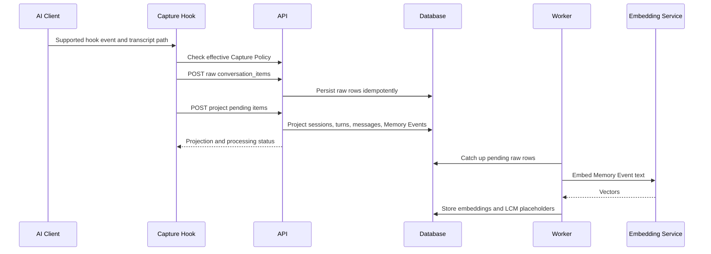
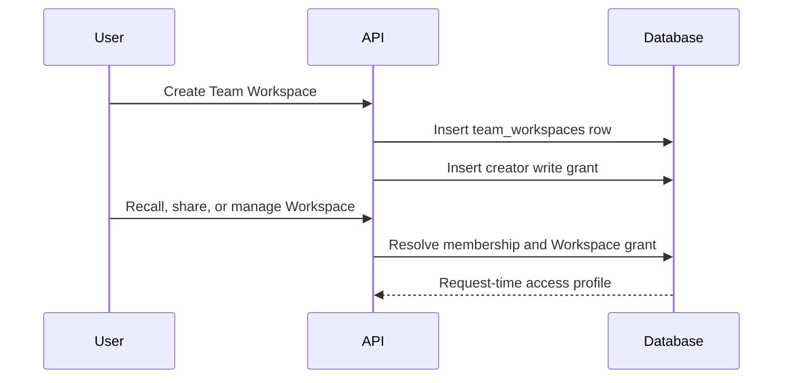
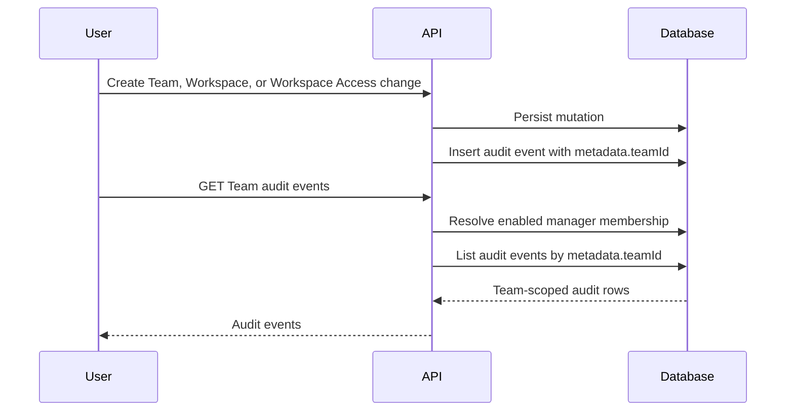
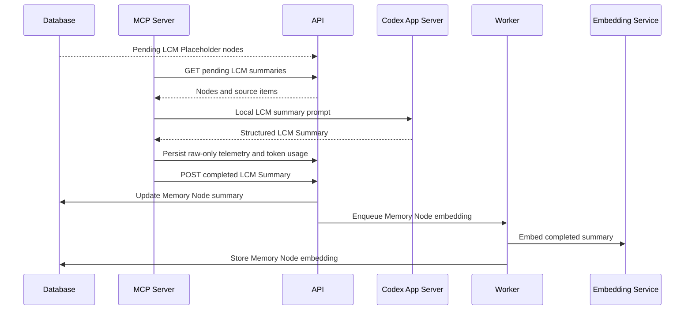
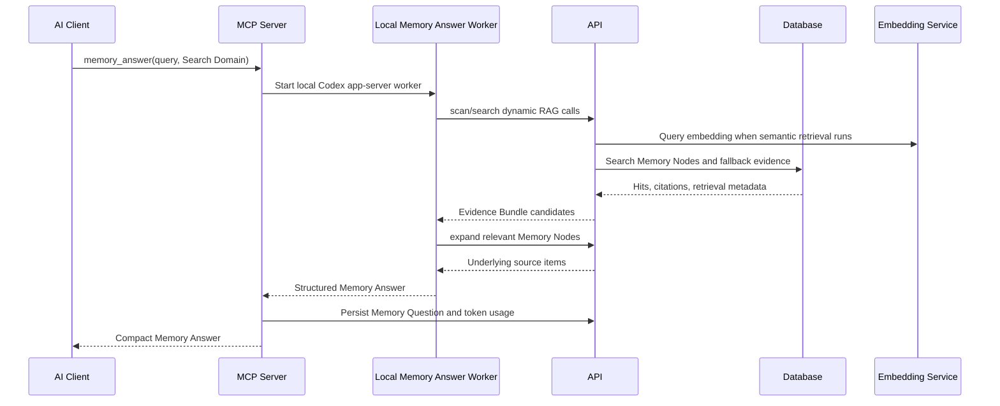

# Service Sequence Overview

This overview describes the high-level service flow for Koed ingestion,
LCM summarisation, and retrieval. It follows the current self-hosted boundary:
the backend stores, projects, embeds, and retrieves memory, while the connected
AI Client performs Answer Synthesis and creates LCM Summaries through local
MCP-side workers.

## Services In Scope

- **AI Client**: Codex is the supported AI Client in this build.
- **Capture Hook**: the TypeScript hook that sends conversation activity to Koed.
- **MCP Server**: the local process that exposes `memory_answer`, runs local
  memory-answer work, and runs the LCM Summary Service.
- **API**: the Fastify backend that authenticates API Tokens, persists raw
  records, runs Projection, and serves recall endpoints.
- **Worker**: the BullMQ/background process that performs catch-up projection,
  embedding work, and LCM node embedding.
- **Embedding Service**: local service that turns memory text into retrieval
  vectors.
- **Database**: Postgres storage for raw conversation items, projected semantic
  rows, Memory Events, Memory Nodes, embeddings, questions, token usage, and
  Team Workspace access records.

## Ingestion

1. Codex emits supported hook events such as `SessionStart`,
   `UserPromptSubmit`, `PostToolUse`, `Stop`, `SubagentStart`, and
   `SubagentStop`.
2. The TypeScript Capture Hook reads the hook payload and transcript tail,
   resolves local configuration, and checks the effective Capture Policy when
   needed.
3. The Capture Hook converts Codex transcript records into canonical raw
   `conversation_items` with `sourceAdapterVersion=codex-transcript-v1`,
   `sourceTransport=hook`, idempotency keys, source hashes, and
   `projectionStatus=pending`.
4. The API authenticates the API Token and persists the raw items as
   `personal` memory through `POST /v1/memory/conversation-items`.
5. While still inside the hook deadline, the Capture Hook tries foreground
   projection through `POST /v1/memory/conversation-items/project`. If this is
   too slow or unavailable, raw rows remain pending for catch-up.
6. Projection derives Koed semantic rows: Captured Sessions, turns, messages,
   tool events, Memory Events, source links, and token usage where available.
   Agent work is bundled into semantic `agent_turn` Memory Events only when a
   seal condition is reached.
7. The API schedules processing for newly projected Memory Events. The Worker
   also runs a catch-up loop over pending or failed raw rows.
8. The Worker embeds Memory Events by calling the Embedding Service and then
   upserts source embeddings.
9. The Worker schedules compaction, creating or updating LCM Placeholder Memory
   Nodes from Memory Events and child nodes, then queues Memory Node embedding.
10. Pending LCM placeholders remain available as degraded evidence until local
    LCM summaries are submitted.

## Team Workspace Access Foundation

The Team SaaS storage foundation keeps Memory ownership separate from
Team Workspace visibility. Team membership identifies whether a User can manage
team-level settings, while a Team Workspace access grant controls whether that
User can recall from, share into, or manage a specific Team Workspace.

1. A User with enabled owner/admin membership creates a Team Workspace.
2. The API stores the `team_workspaces` row and a creator self-grant with
   `write` access in one transaction.
3. Workspace access checks resolve enabled membership and the Workspace grant at
   request time. A missing grant is treated as `disabled`.
4. Recall and share decisions use the resolved Workspace grant: `read` can
   recall, `write` can recall and create shares, and `disabled` can do neither.
5. Workspace grant management requires both enabled owner/admin membership and a
   `write` grant on that Team Workspace, so Workspace-level downgrades take
   effect without rotating credentials.

## Team Audit Log

Team audit events record Team and Workspace control-plane changes without
copying or re-owning Memory. The audit surface is manager-only and scoped by
Team id stored in audit metadata, so Team managers can inspect Team changes
without gaining direct access to unrelated personal records.

1. Team creation writes an audit event with `metadata.teamId` set to the new
   Team id.
2. Team Workspace creation writes an audit event after the Workspace row and
   creator access grant are persisted.
3. Workspace Access create, update, and removal flows write audit events after
   the access mutation is stored.
4. A User requests `GET /v1/teams/:teamId/audit-events`.
5. The API authenticates the User session, resolves Team Membership, and allows
   the listing only for enabled Team managers.
6. The repository lists audit rows whose `metadata.teamId` matches the
   requested Team id, optionally filtered by action and limit.
7. The API returns audit records without exposing sensitive invite or password
   fields in metadata.

## LCM Summarisation

1. Projection and compaction create LCM Placeholder Memory Nodes from
   token-bounded Memory Event spans or lower-level Memory Nodes.
2. The MCP Server starts the local LCM Summary Service on a timer and can also
   nudge it after capture.
3. The LCM Summary Service asks the API for pending session titles and pending
   LCM summaries.
4. The API returns LCM nodes plus ordered source items and marks the work as
   local-only; the backend does not call an LLM for LCM summaries.
5. The local LCM worker builds token-bounded prompts from exact source items or
   child summaries.
6. The LCM worker runs Codex app-server mode locally under the user's Codex
   subscription and parses the returned structured LCM Summary.
7. App-server workflow telemetry is persisted as raw-only conversation items,
   and provider token usage is recorded for attribution.
8. The LCM worker submits the completed LCM Summary to
   `POST /v1/memory/lcm/summaries/{nodeId}`.
9. The API updates the Memory Node summary fields and enqueues Memory Node
   embedding.
10. The Worker embeds the updated Memory Node so retrieval can use the
    completed summary.

## Team Sharing

Team-shared Memory remains user-owned. Sharing is represented by a Share Grant
from one Captured Session to one Team and one Workspace. A Workspace is the
stable shared ID for memories; Project context such as local repo, filepath,
ref, branch, or cwd is used only to resolve or display a Workspace.

1. The User selects a Captured Session, Team, Workspace, and expansion level.
2. The API authenticates the API Token as the owning User.
3. The API verifies Team Membership and Workspace Access for the User.
4. The API creates or revokes the Share Grant and writes an audit event.
5. Recall uses active Share Grants at request time, plus independent lifecycle
   gates for Access Suspension, Workspace archive state, membership state,
   and Workspace Access.
6. Personal deletion removes memory from the owner's Personal Memory recall
   surface but does not revoke an active Team / Workspace Share Grant in the
   first version.
7. If a local Project context is supplied during recall, the API resolves it to
   a Workspace before Team-shared retrieval. Local Project metadata is not a
   durable authorization key.
8. Archived search is an explicit mode, not the default active recall path. It
   may include retained Workspaces only when the caller and retention policy
   allow it. Access-suspended Team data belongs to a separate admin, legal, or
   Operator mode, not ordinary archived search.

## Retrieval

1. The AI Client calls the MCP Server's `memory_answer` tool with a query,
   Retrieval Scope, and Search Domain.
2. The MCP Server starts a local memory-answer worker in Codex app-server mode.
   The worker is given only Koed dynamic RAG tools: `scan`, `search`, and
   `expand`.
3. The local memory-answer worker calls API search through the MCP client's
   dynamic tools. Project search defaults to the current project path, and that
   Project context may resolve to a Workspace for Team-shared search; session
   search requires a captured-session id; global search still only searches
   memory visible through the selected Retrieval Scope.
4. The API authenticates the API Token and calls the core recall path.
5. The repository validates the Search Domain, applies Personal Memory and
   active Team / Workspace Share Grant authorization during candidate selection,
   applies lifecycle gates such as Access Suspension and Workspace archive state,
   and runs retrieval stages over Memory Nodes, fresh pending Memory Events,
   raw fallback evidence, and lexical matches. Semantic stages use local
   embedding search and may be reranked when configured.
6. The API returns hits, citations, and retrieval metadata. When a promising
   Memory Node needs more detail, the local memory-answer worker can call
   `expand` to fetch underlying source items.
7. The local memory-answer worker performs Answer Synthesis from the retrieved
   Evidence Bundle and returns structured answer JSON.
8. The MCP Server compacts the response according to `response_detail`.
9. The MCP Server persists the Memory Question result and records token usage
   for the local app-server answer work.
10. The AI Client receives the final Memory Answer and can cite returned
    evidence when requested.

### Recall Stage Ordering

Default recall uses a coarse-to-fine stage order:

1. **Rollup search** looks for broad LCM Rollup matches first.
2. **Scoped leaf search** searches LCM Leaves beneath selected rollups for
   more detailed evidence.
3. **Leaf search** also searches LCM Leaves independently, so detailed evidence
   can surface even when its parent rollup was not selected.
4. **Fresh pending search** searches recent Memory Events that have not yet
   been compacted into LCM Leaves.
5. **Raw fallback search** searches raw embedded evidence and is admitted only
   when higher-priority stages have not filled the requested evidence limit,
   unless the caller explicitly requests raw fallback.

Lexical search is available for exact phrases, identifiers, filenames, error
text, named topics, or recovery after semantic stages fail. It is not the normal
first path for Memory Answer recall.

Stage scores are directional relevance signals. Final evidence selection favors
stage priority first, then weighted score, recency, and stable source ordering.
Pending LCM Summary work may be returned as degraded evidence; the AI Client
should surface that status and rely cautiously on exact source text rather than
treating the pending summary as complete.

## Implementation Anchors

- Capture Hook: `packages/mcp-server/src/capture-hook.ts`
- Raw ingestion API: `apps/api/src/memory/raw-conversation-routes.ts`
- Raw projection catch-up: `apps/worker/src/raw-projection-service.ts`
- Embedding workflow: `apps/worker/src/embedding-workflow.ts`
- LCM Summary Service: `packages/mcp-server/src/lcm-summary-service.ts`
- LCM summary worker: `packages/mcp-server/src/lcm-summary-worker.ts`
- LCM API routes: `apps/api/src/memory/lcm-routes.ts`
- MCP `memory_answer`: `packages/mcp-server/src/cli.ts`
- Memory answer worker: `packages/mcp-server/src/answer-worker.ts`
- Recall API routes: `apps/api/src/memory/recall-routes.ts`
- Core recall contract: `packages/core/src/index.ts`
- Repository retrieval stages: `packages/db/src/repository.ts`
- Team routes: `apps/api/src/team/routes.ts`
- Team audit repository: `packages/db/src/audit-repository.ts`
